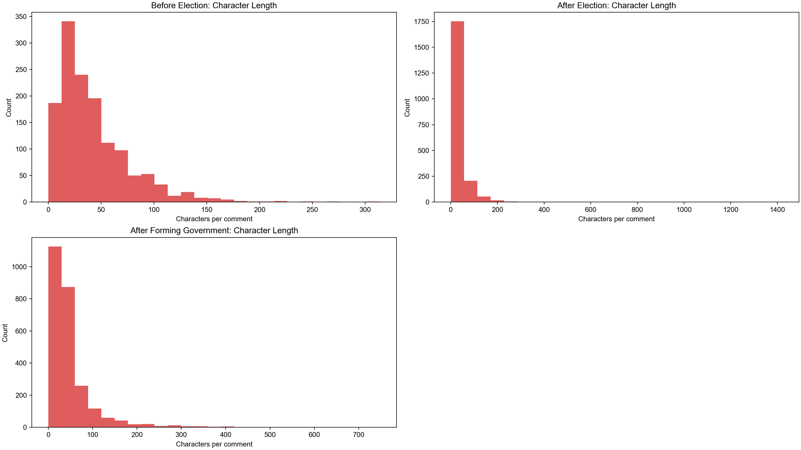
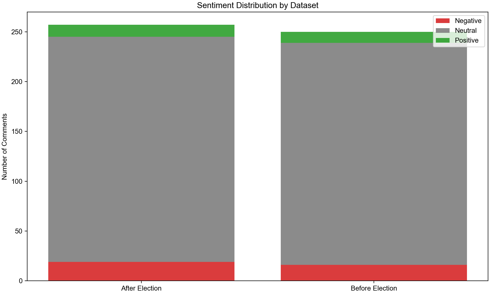
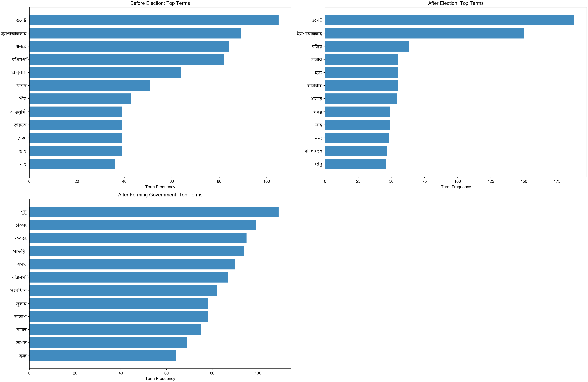
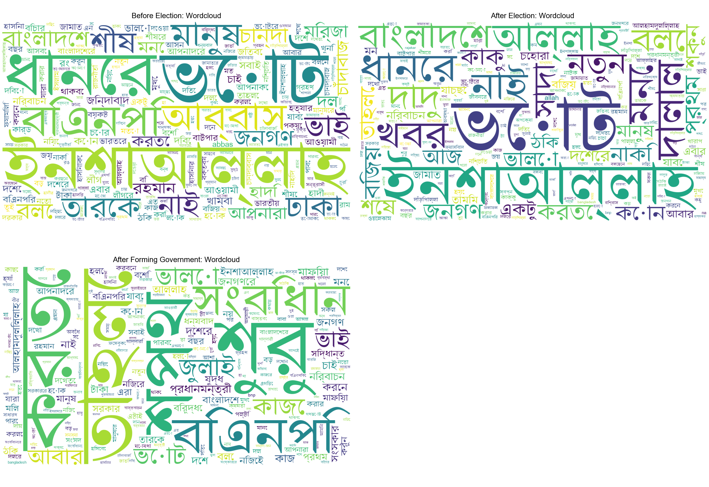
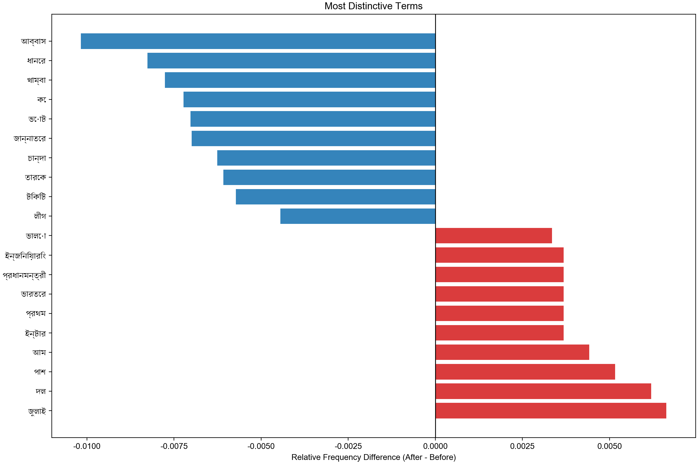
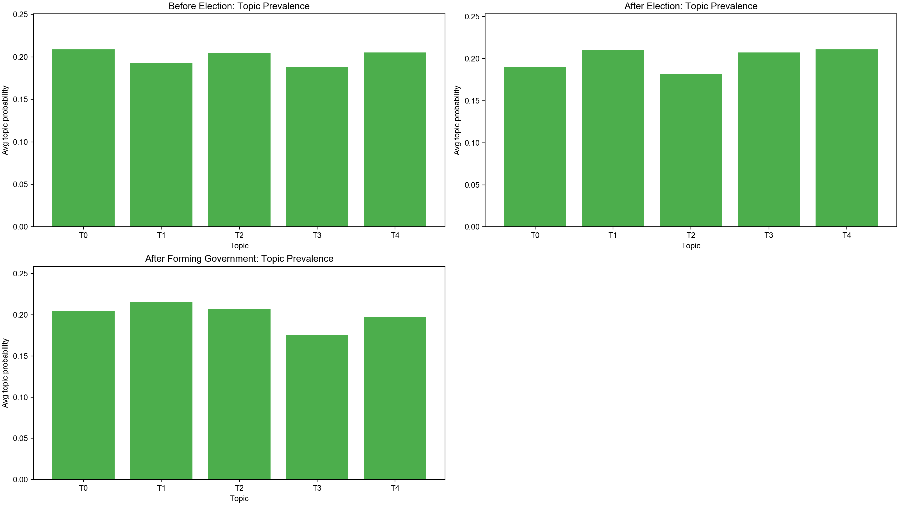

# Bangla Election Text Analysis

This README is synchronized with the **updated data files** and the refactored multi-dataset analysis pipeline.

## Run

```bash
.venv/bin/python scripts/election_text_exploration.py
```

## Output Artifact Index

| File | Type | Size (bytes) | Notes |
| --- | --- | ---: | --- |
| [`cleaned_documents.csv`](outputs/election_text_analysis/cleaned_documents.csv) | CSV | 2994376 | Combined cleaned documents across all detected datasets |
| [`document_sentiment.csv`](outputs/election_text_analysis/document_sentiment.csv) | CSV | 1569744 | Document-level sentiment labels/scores |
| [`document_topics_after_election.csv`](outputs/election_text_analysis/document_topics_after_election.csv) | CSV | 487991 | Document topics for After Election |
| [`document_topics_after_forming_government.csv`](outputs/election_text_analysis/document_topics_after_forming_government.csv) | CSV | 816512 | Document topics for After Forming Government |
| [`document_topics_all.csv`](outputs/election_text_analysis/document_topics_all.csv) | CSV | 1685459 | Document-level dominant topics for all datasets combined |
| [`document_topics_before_election.csv`](outputs/election_text_analysis/document_topics_before_election.csv) | CSV | 381122 | Document topics for Before Election |
| [`plot_distinctive_terms.png`](outputs/election_text_analysis/plot_distinctive_terms.png) | PNG | 151416 | Distinctive terms by dataset (vs average of others) |
| [`plot_length_distribution.png`](outputs/election_text_analysis/plot_length_distribution.png) | PNG | 114069 | Character length distributions by dataset |
| [`plot_sentiment_distribution.png`](outputs/election_text_analysis/plot_sentiment_distribution.png) | PNG | 52360 | Sentiment class distribution by dataset |
| [`plot_top_terms.png`](outputs/election_text_analysis/plot_top_terms.png) | PNG | 150757 | Top-term frequency plots by dataset |
| [`plot_topic_prevalence.png`](outputs/election_text_analysis/plot_topic_prevalence.png) | PNG | 105400 | Topic prevalence charts by dataset |
| [`plot_wordcloud.png`](outputs/election_text_analysis/plot_wordcloud.png) | PNG | 2324318 | Wordclouds by dataset |
| [`report.md`](outputs/election_text_analysis/report.md) | Markdown | 7129 | Generated analysis report |
| [`sentiment_summary.csv`](outputs/election_text_analysis/sentiment_summary.csv) | CSV | 501 | Sentiment counts and percentages by dataset |
| [`summary_stats.csv`](outputs/election_text_analysis/summary_stats.csv) | CSV | 380 | Dataset-level summary statistics |
| [`term_comparison_full.csv`](outputs/election_text_analysis/term_comparison_full.csv) | CSV | 2736243 | Distinctive term scores against other datasets |
| [`top_terms_after_election.csv`](outputs/election_text_analysis/top_terms_after_election.csv) | CSV | 2213 | Top terms for After Election |
| [`top_terms_after_forming_government.csv`](outputs/election_text_analysis/top_terms_after_forming_government.csv) | CSV | 2676 | Top terms for After Forming Government |
| [`top_terms_all.csv`](outputs/election_text_analysis/top_terms_all.csv) | CSV | 7085 | Top terms for all datasets combined in one table |
| [`top_terms_before_election.csv`](outputs/election_text_analysis/top_terms_before_election.csv) | CSV | 2262 | Top terms for Before Election |
| [`topics_after_election.csv`](outputs/election_text_analysis/topics_after_election.csv) | CSV | 2860 | Topics for After Election |
| [`topics_after_forming_government.csv`](outputs/election_text_analysis/topics_after_forming_government.csv) | CSV | 3131 | Topics for After Forming Government |
| [`topics_all.csv`](outputs/election_text_analysis/topics_all.csv) | CSV | 8575 | All extracted topics (all datasets) |
| [`topics_before_election.csv`](outputs/election_text_analysis/topics_before_election.csv) | CSV | 3022 | Topics for Before Election |

## Integrated Report (with visuals)

### Dataset Summary

| dataset | total_rows | non_empty_rows | empty_raw_rows | empty_after_clean | avg_char_length | median_char_length | avg_token_length | median_token_length |
| --- | --- | --- | --- | --- | --- | --- | --- | --- |
| After Election | 2044 | 1935 | 109 | 116 | 36.82583170254403 | 26.0 | 5.153620352250489 | 4.0 |
| After Forming Government | 2559 | 2517 | 42 | 93 | 48.95974990230559 | 33.0 | 6.518561938257132 | 4.0 |
| Before Election | 1370 | 1358 | 12 | 18 | 42.93576642335766 | 33.5 | 6.008759124087591 | 5.0 |



### Sentiment Summary

| dataset | sentiment_label | count | percentage |
| --- | --- | --- | --- |
| After Election | negative | 116 | 0.05675146771037182 |
| After Election | neutral | 1826 | 0.8933463796477495 |
| After Election | positive | 102 | 0.049902152641878667 |
| After Forming Government | negative | 119 | 0.04650254005470887 |
| After Forming Government | neutral | 2221 | 0.867917155138726 |
| After Forming Government | positive | 219 | 0.08558030480656506 |
| Before Election | negative | 95 | 0.06934306569343066 |
| Before Election | neutral | 1198 | 0.8744525547445255 |
| Before Election | positive | 77 | 0.05620437956204379 |



### Top Terms by Dataset



### Wordcloud by Dataset



### Distinctive Terms (sample)

| dataset | term | count | relative_freq | others_avg_relative_freq | distinctiveness_score |
| --- | --- | --- | --- | --- | --- |
| After Election | ভোট | 188 | 0.017846971710651225 | 0.008202818025477681 | 0.009644153685173544 |
| After Election | ইনশাআল্লাহ | 148 | 0.01404974368710841 | 0.0068444963861691195 | 0.0072052473009392905 |
| After Election | দালাল | 55 | 0.005221188532371369 | 0.00045277387976952064 | 0.004768414652601849 |
| After Election | খবর | 49 | 0.004651604328839947 | 0.00027292854675591233 | 0.004378675782084034 |
| After Election | দাদু | 46 | 0.004366812227074236 | 0.00027292854675591233 | 0.004093883680318323 |
| After Forming Government | শুরু | 109 | 0.006534380432827768 | 0.0010156731601479996 | 0.005518707272679768 |
| After Forming Government | শপথ | 90 | 0.005395359990408249 | 0.00012147716229348882 | 0.0052738828281147605 |
| After Forming Government | সংবিধান | 82 | 0.004915772435705294 | 0.0 | 0.004915772435705294 |
| After Forming Government | কাজে | 75 | 0.004496133325340207 | 0.00027714644402880356 | 0.004218986881311403 |
| After Forming Government | জুলাই | 78 | 0.004675978658353816 | 0.0007783464086765738 | 0.0038976322496772423 |
| Before Election | আব্বাস | 64 | 0.007774538386783284 | 0.0 | 0.007774538386783284 |
| Before Election | ধানের | 84 | 0.01020408163265306 | 0.002683025804567138 | 0.007521055828085922 |
| Before Election | বিএনপি | 82 | 0.009961127308066083 | 0.0035095989842887387 | 0.006451528323777345 |
| Before Election | ঢাকা | 39 | 0.0047376093294460644 | 0.0003147663239346457 | 0.004422843005511419 |
| Before Election | শীষ | 43 | 0.00522351797862002 | 0.0010866950226867927 | 0.004136822955933227 |



### Topic Snapshot

| dataset | topic_id | topic_prevalence | top_terms |
| --- | --- | --- | --- |
| Before Election | 0 | 0.16401845404360083 | আব্বাস, চান্দা, তুই, চাঁদাবাজ, খুনি, নিশ্চিত, রং, বড়, হাদীর, ভাই |
| Before Election | 1 | 0.20916906075298514 | মানুষ, ভালো, লীগ, আওয়ামী, দেশে, বিএনপি, নির্বাচন, সবাই, হাসিনা, নাই |
| Before Election | 2 | 0.18407452225379417 | বিএনপি, জিন্দাবাদ, খাম্বা, ভারতের, বাংলাদেশ, ভোট, থাকবে, রং, দল, পাবে |
| Before Election | 3 | 0.18745659390912833 | হাদি, মনে, নাই, ঢাকা, বলে, ঠিক, বিচার, করতে, দল, হত্যার |
| Before Election | 4 | 0.2552813690404904 | ইনশাআল্লাহ, ভোট, ধানের, শীষ, তারেক, আব্বাস, বিএনপি, রহমান, মির্জা, বাংলাদেশ |
| After Election | 0 | 0.22454060155198557 | ইনশাআল্লাহ, দালাল, আল্লাহ, ভোট, ধানের, বিজয়, বিজয়, শীষ, তামিম, জয় |
| After Election | 1 | 0.18418624333374198 | একটু, তাহলে, পাল্লা, জিতবে, এবার, চেহারা, বলবে, কাকু, na, কাক্কু |
| After Election | 2 | 0.20412370541232971 | খবর, দাদু, সাদা, শকুন, নাকি, মন, শেষ, আলহামদুলিল্লাহ, খারাপ, ভোট |
| After Election | 3 | 0.21026904292926504 | ভোট, বলে, আজ, জনগণ, নতুন, যাবে, যাচ্ছে, আবার, দেখা, বাংলাদেশ |
| After Election | 4 | 0.17688040677267622 | ভোট, বাংলাদেশ, allah, কাকু, নাটক, নাই, প্রথম, এত, টা, বছর |
| After Forming Government | 0 | 0.1702864884024168 | কাজে, মিল, ঠিক, কথায়, থাকে, নয়, কাজের, করি, আপনাকে, বড় |
| After Forming Government | 1 | 0.20436803637656337 | চাই, আলহামদুলিল্লাহ, কাজ, দেশের, সিদ্ধান্ত, ধন্যবাদ, মনে, দেখতে, প্রথম, ভালো |
| After Forming Government | 2 | 0.21108829060116732 | শুরু, ভালো, করতে, আল্লাহ, ভাই, তারেক, করেন, রহমান, করুন, পল্টি |
| After Forming Government | 3 | 0.19405797607726813 | মাফিয়া, ইনশাআল্লাহ, যুদ্ধ, নিজেই, মাফিয়া, বিরুদ্ধে, নিজের, বড়, নিজে, যাবে |
| After Forming Government | 4 | 0.2201992085425821 | শপথ, সংবিধান, ভোট, তাহলে, সংস্কার, বিএনপি, করতে, নির্বাচন, জুলাই, সরকার |



## CSV Outputs as Tables

All CSV outputs are shown below as Markdown tables. Large files are shown as previews with links to full files.

### `cleaned_documents.csv`

- Full file: [`cleaned_documents.csv`](outputs/election_text_analysis/cleaned_documents.csv)
- Row count: `5973`

Showing first `20` rows:

| dataset | dataset_slug | doc_id | raw_text | clean_text | tokens | token_text | char_len | token_len | is_empty_raw | is_empty_tokenized | positive_hits | negative_hits | sentiment_score | sentiment_label |
| --- | --- | --- | --- | --- | --- | --- | --- | --- | --- | --- | --- | --- | --- | --- |
| Before Election | before_election | 0 | লিডার চালিয়ে যান পুরো পৃথিবী আপনার বিপক্ষে থাকলেও আমি পৃথিবীর পক্ষেই আছি | লিডার চালিয়ে যান পুরো পৃথিবী আপনার বিপক্ষে থাকলেও আমি পৃথিবীর পক্ষেই আছি | ['লিডার', 'চালিয়ে', 'যান', 'পুরো', 'পৃথিবী', 'বিপক্ষে', 'থাকলেও', 'পৃথিবীর', 'পক্ষেই', 'আছি'] | লিডার চালিয়ে যান পুরো পৃথিবী বিপক্ষে থাকলেও পৃথিবীর পক্ষেই আছি | 72 | 10 | 0 | 0 | 0 | 0 | 0.0 | neutral |
| Before Election | before_election | 1 | ভোট দিবো ধানের শীর্ষে চাঁদা তুলবো মিলেমিশে | ভোট দিবো ধানের শীর্ষে চাঁদা তুলবো মিলেমিশে | ['ভোট', 'দিবো', 'ধানের', 'শীর্ষে', 'চাঁদা', 'তুলবো', 'মিলেমিশে'] | ভোট দিবো ধানের শীর্ষে চাঁদা তুলবো মিলেমিশে | 42 | 7 | 0 | 0 | 0 | 0 | 0.0 | neutral |
| Before Election | before_election | 2 | ছেলেটা দারুণ সাহসী। এতো জুতা খাওয়ার পরও নতুন নতুন বানী নিয়ে চলে আসে,, বাহ -- লেগে থাক ভাই.. | ছেলেটা দারুণ সাহসী এতো জুতা খাওয়ার পরও নতুন নতুন বানী নিয়ে চলে আসে বাহ লেগে থাক ভাই | ['ছেলেটা', 'দারুণ', 'সাহসী', 'এতো', 'জুতা', 'খাওয়ার', 'পরও', 'নতুন', 'নতুন', 'বানী', 'নিয়ে', 'চলে', 'আসে', 'বাহ', 'লেগে', 'থাক', 'ভাই'] | ছেলেটা দারুণ সাহসী এতো জুতা খাওয়ার পরও নতুন নতুন বানী নিয়ে চলে আসে বাহ লেগে থাক ভাই | 91 | 17 | 0 | 0 | 1 | 0 | 0.058823529411764705 | positive |
| Before Election | before_election | 3 | জনগণের ইচ্ছে যাকে খুশি তাকে ভোট দিবে দেশ টাকার বাবার না স্বৈরাচারের মতো ব্যবহার করে পরিপাশে আগস্টের মত শেখ হাসিনার মত হবে ইনশাআল্লাহ | জনগণের ইচ্ছে যাকে খুশি তাকে ভোট দিবে দেশ টাকার বাবার না স্বৈরাচারের মতো ব্যবহার করে পরিপাশে আগস্টের মত শেখ হাসিনার মত হবে ইনশাআল্লাহ | ['জনগণের', 'ইচ্ছে', 'যাকে', 'খুশি', 'তাকে', 'ভোট', 'দিবে', 'দেশ', 'টাকার', 'বাবার', 'স্বৈরাচারের', 'মতো', 'ব্যবহার', 'পরিপাশে', 'আগস্টের', 'মত', 'শেখ', 'হাসিনার', 'মত', 'ইনশাআল্লাহ'] | জনগণের ইচ্ছে যাকে খুশি তাকে ভোট দিবে দেশ টাকার বাবার স্বৈরাচারের মতো ব্যবহার পরিপাশে আগস্টের মত শেখ হাসিনার মত ইনশাআল্লাহ | 132 | 20 | 0 | 0 | 1 | 0 | 0.05 | positive |
| Before Election | before_election | 4 | এদেশের গর্ব তুমি ভাই আরও এগিয়ে যাও! পাবনার দিকে | এদেশের গর্ব তুমি ভাই আরও এগিয়ে যাও পাবনার দিকে | ['এদেশের', 'গর্ব', 'ভাই', 'এগিয়ে', 'যাও', 'পাবনার'] | এদেশের গর্ব ভাই এগিয়ে যাও পাবনার | 47 | 6 | 0 | 0 | 0 | 0 | 0.0 | neutral |
| Before Election | before_election | 5 | সাহসী নেতার সাহসী বাণী! | সাহসী নেতার সাহসী বাণী | ['সাহসী', 'নেতার', 'সাহসী', 'বাণী'] | সাহসী নেতার সাহসী বাণী | 23 | 4 | 0 | 0 | 0 | 0 | 0.0 | neutral |
| Before Election | before_election | 6 | "১২ তারিখের পর ওই এলাকার মানুষ ওকে খুঁজবে। আর ও কোথায় থাকবে, তা জানা নেই। | তারিখের পর ওই এলাকার মানুষ ওকে খুঁজবে আর ও কোথায় থাকবে তা জানা নেই | ['তারিখের', 'পর', 'এলাকার', 'মানুষ', 'ওকে', 'খুঁজবে', 'থাকবে', 'তা', 'জানা'] | তারিখের পর এলাকার মানুষ ওকে খুঁজবে থাকবে তা জানা | 73 | 9 | 0 | 0 | 0 | 0 | 0.0 | neutral |
| Before Election | before_election | 7 | তারুণ্যের প্রথম ভোটটি হোক অন্যায়, দুর্নীতি, চাদাবাজি, ঋণ খেলাপির বিরুদ্ধে। ন্যায় সততা ও ইনসাফ এর পক্ষে, শিক্ষিত মার্জিত! একজন ভালো ব্যক্তির পক্ষে! | তারুণ্যের প্রথম ভোটটি হোক অন্যায় দুর্নীতি চাদাবাজি ঋণ খেলাপির বিরুদ্ধে ন্যায় সততা ও ইনসাফ এর পক্ষে শিক্ষিত মার্জিত একজন ভালো ব্যক্তির পক্ষে | ['তারুণ্যের', 'প্রথম', 'ভোটটি', 'হোক', 'অন্যায়', 'দুর্নীতি', 'চাদাবাজি', 'ঋণ', 'খেলাপির', 'বিরুদ্ধে', 'ন্যায়', 'সততা', 'ইনসাফ', 'পক্ষে', 'শিক্ষিত', 'মার্জিত', 'ভালো', 'ব্যক্তির', 'পক্ষে'] | তারুণ্যের প্রথম ভোটটি হোক অন্যায় দুর্নীতি চাদাবাজি ঋণ খেলাপির বিরুদ্ধে ন্যায় সততা ইনসাফ পক্ষে শিক্ষিত মার্জিত ভালো ব্যক্তির পক্ষে | 146 | 19 | 0 | 0 | 1 | 2 | -0.05263157894736842 | negative |
| Before Election | before_election | 8 |  |  | [] |  | 0 | 0 | 1 | 1 | 0 | 0 | 0.0 | neutral |
| Before Election | before_election | 9 | নেতা এমনই হওয়া দরকার | নেতা এমনই হওয়া দরকার | ['নেতা', 'এমনই', 'হওয়া', 'দরকার'] | নেতা এমনই হওয়া দরকার | 20 | 4 | 0 | 0 | 0 | 0 | 0.0 | neutral |
| Before Election | before_election | 10 | বেশি লাফালাফি করলে দাঁড়িয়ে থাকতে পারবে না | বেশি লাফালাফি করলে দাঁড়িয়ে থাকতে পারবে না | ['বেশি', 'লাফালাফি', 'করলে', 'দাঁড়িয়ে', 'থাকতে', 'পারবে'] | বেশি লাফালাফি করলে দাঁড়িয়ে থাকতে পারবে | 43 | 6 | 0 | 0 | 0 | 0 | 0.0 | neutral |
| Before Election | before_election | 11 | চাঁদাবাজ মুক্ত সন্ত্রাস মুক্ত দূর্নীতি মুক্ত দেশ গড়তে দাঁড়িপাল্লায় ভোট দিয়ে জয়যুক্ত করুন ইনসাফের রাষ্ট্র গঠন করুন। | চাঁদাবাজ মুক্ত সন্ত্রাস মুক্ত দূর্নীতি মুক্ত দেশ গড়তে দাঁড়িপাল্লায় ভোট দিয়ে জয়যুক্ত করুন ইনসাফের রাষ্ট্র গঠন করুন | ['চাঁদাবাজ', 'মুক্ত', 'সন্ত্রাস', 'মুক্ত', 'দূর্নীতি', 'মুক্ত', 'দেশ', 'গড়তে', 'দাঁড়িপাল্লায়', 'ভোট', 'জয়যুক্ত', 'করুন', 'ইনসাফের', 'রাষ্ট্র', 'গঠন', 'করুন'] | চাঁদাবাজ মুক্ত সন্ত্রাস মুক্ত দূর্নীতি মুক্ত দেশ গড়তে দাঁড়িপাল্লায় ভোট জয়যুক্ত করুন ইনসাফের রাষ্ট্র গঠন করুন | 119 | 16 | 0 | 0 | 0 | 1 | -0.0625 | negative |
| Before Election | before_election | 12 | প্রতিহিংসার রাজনীতি না করি কিভাবে দেশে ভালো কিছু করা যায় সেভাবে কাজ করি | প্রতিহিংসার রাজনীতি না করি কিভাবে দেশে ভালো কিছু করা যায় সেভাবে কাজ করি | ['প্রতিহিংসার', 'রাজনীতি', 'করি', 'কিভাবে', 'দেশে', 'ভালো', 'সেভাবে', 'কাজ', 'করি'] | প্রতিহিংসার রাজনীতি করি কিভাবে দেশে ভালো সেভাবে কাজ করি | 71 | 9 | 0 | 0 | 1 | 0 | 0.1111111111111111 | positive |
| Before Election | before_election | 13 | নৌকা গেছে যে পথে, ধানের শীষ যাবে সে পথে। নৌকা আর ধানের শীষ লাঙ্গল দেখাও শেষ, দাঁড়িপাল্লা গড়বে এবার সোনার বাংলাদেশ। | নৌকা গেছে যে পথে ধানের শীষ যাবে সে পথে নৌকা আর ধানের শীষ লাঙ্গল দেখাও শেষ দাঁড়িপাল্লা গড়বে এবার সোনার বাংলাদেশ | ['নৌকা', 'পথে', 'ধানের', 'শীষ', 'যাবে', 'সে', 'পথে', 'নৌকা', 'ধানের', 'শীষ', 'লাঙ্গল', 'দেখাও', 'শেষ', 'দাঁড়িপাল্লা', 'গড়বে', 'এবার', 'সোনার', 'বাংলাদেশ'] | নৌকা পথে ধানের শীষ যাবে সে পথে নৌকা ধানের শীষ লাঙ্গল দেখাও শেষ দাঁড়িপাল্লা গড়বে এবার সোনার বাংলাদেশ | 114 | 18 | 0 | 0 | 0 | 0 | 0.0 | neutral |
| Before Election | before_election | 14 | সব জায়গায় একই অবস্থা নির্বাচন বন্ধ করে দেওয়া হোক আমি লীগকে ঘুরিয়ে নিয়ে আনুক তারা বিপক্ষে কোন দলকে সাইট দেয় না হুমকি দিয়ে থাকে প্রতিটা ওয়ার্ড পর্দা থেকে একই অবস্থা | সব জায়গায় একই অবস্থা নির্বাচন বন্ধ করে দেওয়া হোক আমি লীগকে ঘুরিয়ে নিয়ে আনুক তারা বিপক্ষে কোন দলকে সাইট দেয় না হুমকি দিয়ে থাকে প্রতিটা ওয়ার্ড পর্দা থেকে একই অবস্থা | ['জায়গায়', 'একই', 'অবস্থা', 'নির্বাচন', 'বন্ধ', 'দেওয়া', 'হোক', 'লীগকে', 'ঘুরিয়ে', 'নিয়ে', 'আনুক', 'বিপক্ষে', 'কোন', 'দলকে', 'সাইট', 'দেয়', 'হুমকি', 'থাকে', 'প্রতিটা', 'ওয়ার্ড', 'পর্দা', 'একই', 'অবস্থা'] | জায়গায় একই অবস্থা নির্বাচন বন্ধ দেওয়া হোক লীগকে ঘুরিয়ে নিয়ে আনুক বিপক্ষে কোন দলকে সাইট দেয় হুমকি থাকে প্রতিটা ওয়ার্ড পর্দা একই অবস্থা | 170 | 23 | 0 | 0 | 0 | 0 | 0.0 | neutral |
| Before Election | before_election | 15 | দল থেকে দেরকে আজীবনের জন্য বহিষ্কার করা হোক,, নয়তো বিএনপি-র ইজ্জত মাঠে থেকে যাবে বাসায় নিয়ে ফিরতে পারবে না | দল থেকে দেরকে আজীবনের জন্য বহিষ্কার করা হোক নয়তো বিএনপি র ইজ্জত মাঠে থেকে যাবে বাসায় নিয়ে ফিরতে পারবে না | ['দল', 'দেরকে', 'আজীবনের', 'বহিষ্কার', 'হোক', 'নয়তো', 'বিএনপি', 'ইজ্জত', 'মাঠে', 'যাবে', 'বাসায়', 'নিয়ে', 'ফিরতে', 'পারবে'] | দল দেরকে আজীবনের বহিষ্কার হোক নয়তো বিএনপি ইজ্জত মাঠে যাবে বাসায় নিয়ে ফিরতে পারবে | 109 | 14 | 0 | 0 | 0 | 0 | 0.0 | neutral |
| Before Election | before_election | 16 | ক্ষমতা আসার আগেই এতো কিছু। ক্ষমতা আসার পর কি হবে একমাত্র আল্লাহ জানে | ক্ষমতা আসার আগেই এতো কিছু ক্ষমতা আসার পর কি হবে একমাত্র আল্লাহ জানে | ['ক্ষমতা', 'আসার', 'আগেই', 'এতো', 'ক্ষমতা', 'আসার', 'পর', 'একমাত্র', 'আল্লাহ', 'জানে'] | ক্ষমতা আসার আগেই এতো ক্ষমতা আসার পর একমাত্র আল্লাহ জানে | 68 | 10 | 0 | 0 | 0 | 0 | 0.0 | neutral |
| Before Election | before_election | 17 | দেশের জনগণ এখন সচেতন। জোরজবরদস্তির রাজনীতি এখন আর চলবে না মানুষ আদর্শবান নেতা চায়, যার হাতে নিরাপদ দেশ ও জাতি | দেশের জনগণ এখন সচেতন জোরজবরদস্তির রাজনীতি এখন আর চলবে না মানুষ আদর্শবান নেতা চায় যার হাতে নিরাপদ দেশ ও জাতি | ['দেশের', 'জনগণ', 'সচেতন', 'জোরজবরদস্তির', 'রাজনীতি', 'চলবে', 'মানুষ', 'আদর্শবান', 'নেতা', 'চায়', 'যার', 'হাতে', 'নিরাপদ', 'দেশ', 'জাতি'] | দেশের জনগণ সচেতন জোরজবরদস্তির রাজনীতি চলবে মানুষ আদর্শবান নেতা চায় যার হাতে নিরাপদ দেশ জাতি | 109 | 15 | 0 | 0 | 1 | 0 | 0.06666666666666667 | positive |
| Before Election | before_election | 18 | এই বক্তব্য জামাতের কেউ দিলে রাকিব চাচা দল বল নিয়ে রাস্তায় নাইমে যাতো | এই বক্তব্য জামাতের কেউ দিলে রাকিব চাচা দল বল নিয়ে রাস্তায় নাইমে যাতো | ['বক্তব্য', 'জামাতের', 'দিলে', 'রাকিব', 'চাচা', 'দল', 'বল', 'নিয়ে', 'রাস্তায়', 'নাইমে', 'যাতো'] | বক্তব্য জামাতের দিলে রাকিব চাচা দল বল নিয়ে রাস্তায় নাইমে যাতো | 68 | 11 | 0 | 0 | 0 | 0 | 0.0 | neutral |
| Before Election | before_election | 19 | বিএনপি আস্তে আস্তে আসল রূপে ফিরে আসতেছে | বিএনপি আস্তে আস্তে আসল রূপে ফিরে আসতেছে | ['বিএনপি', 'আস্তে', 'আস্তে', 'আসল', 'রূপে', 'ফিরে', 'আসতেছে'] | বিএনপি আস্তে আস্তে আসল রূপে ফিরে আসতেছে | 39 | 7 | 0 | 0 | 0 | 0 | 0.0 | neutral |

### `document_sentiment.csv`

- Full file: [`document_sentiment.csv`](outputs/election_text_analysis/document_sentiment.csv)
- Row count: `5973`

Showing first `20` rows:

| dataset | doc_id | raw_text | clean_text | sentiment_label | sentiment_score | positive_hits | negative_hits |
| --- | --- | --- | --- | --- | --- | --- | --- |
| Before Election | 0 | লিডার চালিয়ে যান পুরো পৃথিবী আপনার বিপক্ষে থাকলেও আমি পৃথিবীর পক্ষেই আছি | লিডার চালিয়ে যান পুরো পৃথিবী আপনার বিপক্ষে থাকলেও আমি পৃথিবীর পক্ষেই আছি | neutral | 0.0 | 0 | 0 |
| Before Election | 1 | ভোট দিবো ধানের শীর্ষে চাঁদা তুলবো মিলেমিশে | ভোট দিবো ধানের শীর্ষে চাঁদা তুলবো মিলেমিশে | neutral | 0.0 | 0 | 0 |
| Before Election | 2 | ছেলেটা দারুণ সাহসী। এতো জুতা খাওয়ার পরও নতুন নতুন বানী নিয়ে চলে আসে,, বাহ -- লেগে থাক ভাই.. | ছেলেটা দারুণ সাহসী এতো জুতা খাওয়ার পরও নতুন নতুন বানী নিয়ে চলে আসে বাহ লেগে থাক ভাই | positive | 0.058823529411764705 | 1 | 0 |
| Before Election | 3 | জনগণের ইচ্ছে যাকে খুশি তাকে ভোট দিবে দেশ টাকার বাবার না স্বৈরাচারের মতো ব্যবহার করে পরিপাশে আগস্টের মত শেখ হাসিনার মত হবে ইনশাআল্লাহ | জনগণের ইচ্ছে যাকে খুশি তাকে ভোট দিবে দেশ টাকার বাবার না স্বৈরাচারের মতো ব্যবহার করে পরিপাশে আগস্টের মত শেখ হাসিনার মত হবে ইনশাআল্লাহ | positive | 0.05 | 1 | 0 |
| Before Election | 4 | এদেশের গর্ব তুমি ভাই আরও এগিয়ে যাও! পাবনার দিকে | এদেশের গর্ব তুমি ভাই আরও এগিয়ে যাও পাবনার দিকে | neutral | 0.0 | 0 | 0 |
| Before Election | 5 | সাহসী নেতার সাহসী বাণী! | সাহসী নেতার সাহসী বাণী | neutral | 0.0 | 0 | 0 |
| Before Election | 6 | "১২ তারিখের পর ওই এলাকার মানুষ ওকে খুঁজবে। আর ও কোথায় থাকবে, তা জানা নেই। | তারিখের পর ওই এলাকার মানুষ ওকে খুঁজবে আর ও কোথায় থাকবে তা জানা নেই | neutral | 0.0 | 0 | 0 |
| Before Election | 7 | তারুণ্যের প্রথম ভোটটি হোক অন্যায়, দুর্নীতি, চাদাবাজি, ঋণ খেলাপির বিরুদ্ধে। ন্যায় সততা ও ইনসাফ এর পক্ষে, শিক্ষিত মার্জিত! একজন ভালো ব্যক্তির পক্ষে! | তারুণ্যের প্রথম ভোটটি হোক অন্যায় দুর্নীতি চাদাবাজি ঋণ খেলাপির বিরুদ্ধে ন্যায় সততা ও ইনসাফ এর পক্ষে শিক্ষিত মার্জিত একজন ভালো ব্যক্তির পক্ষে | negative | -0.05263157894736842 | 1 | 2 |
| Before Election | 8 |  |  | neutral | 0.0 | 0 | 0 |
| Before Election | 9 | নেতা এমনই হওয়া দরকার | নেতা এমনই হওয়া দরকার | neutral | 0.0 | 0 | 0 |
| Before Election | 10 | বেশি লাফালাফি করলে দাঁড়িয়ে থাকতে পারবে না | বেশি লাফালাফি করলে দাঁড়িয়ে থাকতে পারবে না | neutral | 0.0 | 0 | 0 |
| Before Election | 11 | চাঁদাবাজ মুক্ত সন্ত্রাস মুক্ত দূর্নীতি মুক্ত দেশ গড়তে দাঁড়িপাল্লায় ভোট দিয়ে জয়যুক্ত করুন ইনসাফের রাষ্ট্র গঠন করুন। | চাঁদাবাজ মুক্ত সন্ত্রাস মুক্ত দূর্নীতি মুক্ত দেশ গড়তে দাঁড়িপাল্লায় ভোট দিয়ে জয়যুক্ত করুন ইনসাফের রাষ্ট্র গঠন করুন | negative | -0.0625 | 0 | 1 |
| Before Election | 12 | প্রতিহিংসার রাজনীতি না করি কিভাবে দেশে ভালো কিছু করা যায় সেভাবে কাজ করি | প্রতিহিংসার রাজনীতি না করি কিভাবে দেশে ভালো কিছু করা যায় সেভাবে কাজ করি | positive | 0.1111111111111111 | 1 | 0 |
| Before Election | 13 | নৌকা গেছে যে পথে, ধানের শীষ যাবে সে পথে। নৌকা আর ধানের শীষ লাঙ্গল দেখাও শেষ, দাঁড়িপাল্লা গড়বে এবার সোনার বাংলাদেশ। | নৌকা গেছে যে পথে ধানের শীষ যাবে সে পথে নৌকা আর ধানের শীষ লাঙ্গল দেখাও শেষ দাঁড়িপাল্লা গড়বে এবার সোনার বাংলাদেশ | neutral | 0.0 | 0 | 0 |
| Before Election | 14 | সব জায়গায় একই অবস্থা নির্বাচন বন্ধ করে দেওয়া হোক আমি লীগকে ঘুরিয়ে নিয়ে আনুক তারা বিপক্ষে কোন দলকে সাইট দেয় না হুমকি দিয়ে থাকে প্রতিটা ওয়ার্ড পর্দা থেকে একই অবস্থা | সব জায়গায় একই অবস্থা নির্বাচন বন্ধ করে দেওয়া হোক আমি লীগকে ঘুরিয়ে নিয়ে আনুক তারা বিপক্ষে কোন দলকে সাইট দেয় না হুমকি দিয়ে থাকে প্রতিটা ওয়ার্ড পর্দা থেকে একই অবস্থা | neutral | 0.0 | 0 | 0 |
| Before Election | 15 | দল থেকে দেরকে আজীবনের জন্য বহিষ্কার করা হোক,, নয়তো বিএনপি-র ইজ্জত মাঠে থেকে যাবে বাসায় নিয়ে ফিরতে পারবে না | দল থেকে দেরকে আজীবনের জন্য বহিষ্কার করা হোক নয়তো বিএনপি র ইজ্জত মাঠে থেকে যাবে বাসায় নিয়ে ফিরতে পারবে না | neutral | 0.0 | 0 | 0 |
| Before Election | 16 | ক্ষমতা আসার আগেই এতো কিছু। ক্ষমতা আসার পর কি হবে একমাত্র আল্লাহ জানে | ক্ষমতা আসার আগেই এতো কিছু ক্ষমতা আসার পর কি হবে একমাত্র আল্লাহ জানে | neutral | 0.0 | 0 | 0 |
| Before Election | 17 | দেশের জনগণ এখন সচেতন। জোরজবরদস্তির রাজনীতি এখন আর চলবে না মানুষ আদর্শবান নেতা চায়, যার হাতে নিরাপদ দেশ ও জাতি | দেশের জনগণ এখন সচেতন জোরজবরদস্তির রাজনীতি এখন আর চলবে না মানুষ আদর্শবান নেতা চায় যার হাতে নিরাপদ দেশ ও জাতি | positive | 0.06666666666666667 | 1 | 0 |
| Before Election | 18 | এই বক্তব্য জামাতের কেউ দিলে রাকিব চাচা দল বল নিয়ে রাস্তায় নাইমে যাতো | এই বক্তব্য জামাতের কেউ দিলে রাকিব চাচা দল বল নিয়ে রাস্তায় নাইমে যাতো | neutral | 0.0 | 0 | 0 |
| Before Election | 19 | বিএনপি আস্তে আস্তে আসল রূপে ফিরে আসতেছে | বিএনপি আস্তে আস্তে আসল রূপে ফিরে আসতেছে | neutral | 0.0 | 0 | 0 |

### `document_topics_after_election.csv`

- Full file: [`document_topics_after_election.csv`](outputs/election_text_analysis/document_topics_after_election.csv)
- Row count: `1928`

Showing first `20` rows:

| dataset | dataset_slug | doc_id | raw_text | clean_text | dominant_topic | dominant_topic_prob |
| --- | --- | --- | --- | --- | --- | --- |
| After Election | after_election | 0 | জিলাপি আছে নাকি? | জিলাপি আছে নাকি | 2 | 0.7326632167183984 |
| After Election | after_election | 1 | Anayet Ahamed: জি ভাই, পুরো ইফতারের সামগ্রী ছিল!! | anayet ahamed জি ভাই পুরো ইফতারের সামগ্রী ছিল | 1 | 0.8997527881286534 |
| After Election | after_election | 2 | দাঁড়িপাল্লার জয় হবে ইনশাআল্লাহ। | দাঁড়িপাল্লার জয় হবে ইনশাআল্লাহ | 0 | 0.799980710056188 |
| After Election | after_election | 3 | হ, ঈদের দিন আজ। | হ ঈদের দিন আজ | 3 | 0.5999969628342516 |
| After Election | after_election | 4 | সবার আগে বাংলাদেশ। | সবার আগে বাংলাদেশ | 4 | 0.5985163470985898 |
| After Election | after_election | 5 | ঢাকা ৪ | ঢাকা | 2 | 0.5962451658024672 |
| After Election | after_election | 6 | ঢাকা ১৩ | ঢাকা | 2 | 0.5962451658024672 |
| After Election | after_election | 7 | হাতিয়া ৬ | হাতিয়া | 4 | 0.5967241968101029 |
| After Election | after_election | 8 | গাজীপুর ৩ | গাজীপুর | 0 | 0.2 |
| After Election | after_election | 9 | ভোট চুরির খবর অলরেডি পাওয়া যাচ্ছে। প্রশাসন নিরব ভূমিকা পালন করতাছে। | ভোট চুরির খবর অলরেডি পাওয়া যাচ্ছে প্রশাসন নিরব ভূমিকা পালন করতাছে | 3 | 0.6061063488560419 |
| After Election | after_election | 10 | দালাল নিউজ এগুলো কই?? | দালাল নিউজ এগুলো কই | 1 | 0.3861906336339117 |
| After Election | after_election | 11 | দুর্নীতিবাজদের রুখে দাও। | দুর্নীতিবাজদের রুখে দাও | 0 | 0.7324079857716644 |
| After Election | after_election | 12 | দাঁড়িপাল্লায় ভোট দাও। | দাঁড়িপাল্লায় ভোট দাও | 4 | 0.7985312587303984 |
| After Election | after_election | 13 | আপনার মূল্যবান ভোটটি, ইনসাফের বাংলাদেশ গড়ার লক্ষ্যে, দাঁড়িপাল্লায় দিন। | আপনার মূল্যবান ভোটটি ইনসাফের বাংলাদেশ গড়ার লক্ষ্যে দাঁড়িপাল্লায় দিন | 4 | 0.8381244735931077 |
| After Election | after_election | 14 | ইউরোপ-আমেরিকা-জাপান এক ই অক্ষ শক্তি। | ইউরোপ আমেরিকা জাপান এক ই অক্ষ শক্তি | 2 | 0.5999866131316132 |
| After Election | after_election | 15 | খেলা যে চলছে কোন লেভেলে! | খেলা যে চলছে কোন লেভেলে | 2 | 0.83906495174273 |
| After Election | after_election | 16 | নতুন বাংলাদেশ বলে কোনো শব্দ নাই। সকল দলের অংশগ্রহণ নিশ্চিত করে নির্বাচন দেওয়া উচিত ছিল। এটা অন্যায় হয়েছে, সঠিক নয়—দেশের জনগণ কখনোই মানে না এসব। | নতুন বাংলাদেশ বলে কোনো শব্দ নাই সকল দলের অংশগ্রহণ নিশ্চিত করে নির্বাচন দেওয়া উচিত ছিল এটা অন্যায় হয়েছে সঠিক নয় দেশের জনগণ কখনোই মানে না এসব | 3 | 0.9632118594512817 |
| After Election | after_election | 17 | লোক নাই, জন নাই—কিন্তু মানুষ না থাকলেও ভোট কেমনে পড়তেছে? এটা খুবই দুঃখজনক ঘটনা। ১ ভোট পড়লেও তা হতে হবে স্বচ্ছতার মাধ্যমে। কোনো মারিক কাটিং বা ফলস ভোট দেওয়া যাবে না, নিরপেক্ষতা বজায় রাখতে হবে। | লোক নাই জন নাই কিন্তু মানুষ না থাকলেও ভোট কেমনে পড়তেছে এটা খুবই দুঃখজনক ঘটনা ভোট পড়লেও তা হতে হবে স্বচ্ছতার মাধ্যমে কোনো মারিক কাটিং বা ফলস ভোট দেওয়া যাবে না নিরপেক্ষতা বজায় রাখতে হবে | 3 | 0.96307315621013 |
| After Election | after_election | 18 | ২০০৮ সালে সকল দলের অংশগ্রহণ নিশ্চিত করে ভোট পড়ে ৮৭.১৩%। | সালে সকল দলের অংশগ্রহণ নিশ্চিত করে ভোট পড়ে | 3 | 0.7216833735365052 |
| After Election | after_election | 19 | এবার কি জনগণের প্রকৃত ভোটে এই শতাংশ ছাড়িয়ে যাবে? মারিক কাটিং হতে দেওয়া যাবে না। ১ ভোট হলেও সেটা হতে হবে জনগণের প্রকৃত ভোট, এছাড়া সব বৃথা। | এবার কি জনগণের প্রকৃত ভোটে এই শতাংশ ছাড়িয়ে যাবে মারিক কাটিং হতে দেওয়া যাবে না ভোট হলেও সেটা হতে হবে জনগণের প্রকৃত ভোট এছাড়া সব বৃথা | 3 | 0.8892310648144318 |

### `document_topics_after_forming_government.csv`

- Full file: [`document_topics_after_forming_government.csv`](outputs/election_text_analysis/document_topics_after_forming_government.csv)
- Row count: `2466`

Showing first `20` rows:

| dataset | dataset_slug | doc_id | raw_text | clean_text | dominant_topic | dominant_topic_prob |
| --- | --- | --- | --- | --- | --- | --- |
| After Forming Government | after_forming_government | 0 | মূল গনতন্ত্র ফিরে পেয়েছে বাংলাদেশ। | মূল গনতন্ত্র ফিরে পেয়েছে বাংলাদেশ | 0 | 0.7954923476669815 |
| After Forming Government | after_forming_government | 1 | নবনির্বাচিত সকল সম্মানিত এমপি মহোদয়দের জানাই আন্তরিক অভিনন্দন ও শুভেচ্ছা। আশা করি, আপনারা দেশের মানুষের প্রত্যাশা ও আস্থার প্রতিফলন ঘটিয়ে সংসদে নতুন দৃষ্টান্ত স্থাপন করবেন। আপনাদের সৎ নেতৃত্ব, দূরদর্শিতা ও জনকল্যাণমূলক কার্যক্রমের মাধ্যমে দেশ এগিয়ে যাবে উন্নয়ন ও সমৃদ্ধির পথে—এই প্রত্যাশাই রইল। | নবনির্বাচিত সকল সম্মানিত এমপি মহোদয়দের জানাই আন্তরিক অভিনন্দন ও শুভেচ্ছা আশা করি আপনারা দেশের মানুষের প্রত্যাশা ও আস্থার প্রতিফলন ঘটিয়ে সংসদে নতুন দৃষ্টান্ত স্থাপন করবেন আপনাদের সৎ নেতৃত্ব দূরদর্শিতা ও জনকল্যাণমূলক কার্যক্রমের মাধ্যমে দেশ এগিয়ে যাবে উন্নয়ন ও সমৃদ্ধির পথে এই প্রত্যাশাই রইল | 1 | 0.4324771252149562 |
| After Forming Government | after_forming_government | 2 | দেড় বছর সরকার চালানোর পর এবার বিরোধীদলে যাচ্ছে জামায়াত -এনসিপি। | দেড় বছর সরকার চালানোর পর এবার বিরোধীদলে যাচ্ছে জামায়াত এনসিপি | 1 | 0.8980213422323451 |
| After Forming Government | after_forming_government | 3 | অভিনন্দন ও শুভকামনা রইল সেই সাথে দেশ দূরনীতি মুক্তর প্রত্যাশা রইলো। | অভিনন্দন ও শুভকামনা রইল সেই সাথে দেশ দূরনীতি মুক্তর প্রত্যাশা রইলো | 1 | 0.8852975212571426 |
| After Forming Government | after_forming_government | 4 | আলহামদুলিল্লাহ l | আলহামদুলিল্লাহ l | 1 | 0.5999985657252962 |
| After Forming Government | after_forming_government | 5 | শুভকামনা রইল l | শুভকামনা রইল l | 1 | 0.7332163380012224 |
| After Forming Government | after_forming_government | 6 | বাংলাদেশের স্বরাষ্ট্রমন্ত্রী কিন্তু ভারত | বাংলাদেশের স্বরাষ্ট্রমন্ত্রী কিন্তু ভারত | 2 | 0.5970728128389364 |
| After Forming Government | after_forming_government | 7 | সরকার গঠন করে | সরকার গঠন করে | 4 | 0.7326374718301881 |
| After Forming Government | after_forming_government | 8 | তারেক রহমানের | তারেক রহমানের | 2 | 0.7331593713945492 |
| After Forming Government | after_forming_government | 9 | বিরোধী দলীয় নেতাদের বাসায় সৌজন্য সাক্ষাৎ দেশের জন্য ইতিবাচক হবে বলে মনে করি ইনশাআল্লাহ। | বিরোধী দলীয় নেতাদের বাসায় সৌজন্য সাক্ষাৎ দেশের জন্য ইতিবাচক হবে বলে মনে করি ইনশাআল্লাহ | 3 | 0.41113298935042913 |
| After Forming Government | after_forming_government | 10 | আলহামদুলিল্লাহ | আলহামদুলিল্লাহ | 1 | 0.5999985657252962 |
| After Forming Government | after_forming_government | 11 | ব্রেকিং | ব্রেকিং | 0 | 0.2 |
| After Forming Government | after_forming_government | 12 | বিএনপি জুলাই এর সংবিধান সংস্কার পরিষদের শপথ নিচ্ছে না । | বিএনপি জুলাই এর সংবিধান সংস্কার পরিষদের শপথ নিচ্ছে না | 4 | 0.899735609135733 |
| After Forming Government | after_forming_government | 13 | - সালাউদ্দিন আহমেদ | সালাউদ্দিন আহমেদ | 1 | 0.7292891910334729 |
| After Forming Government | after_forming_government | 14 | বাংলাদেশ আবার পথ হারালো হয়তো । | বাংলাদেশ আবার পথ হারালো হয়তো | 1 | 0.6111882127457555 |
| After Forming Government | after_forming_government | 15 | ক্রাস খায়েননা,যে ভাবে থাকি আছে আমাদের লিডার। | ক্রাস খায়েননা যে ভাবে থাকি আছে আমাদের লিডার | 2 | 0.4949088855288743 |
| After Forming Government | after_forming_government | 16 | এই-যে আপনাকে বলছি শুনোন শপথ সুন্দর ভাবে করুন দে-শ যেনো ভালো চলে | এই যে আপনাকে বলছি শুনোন শপথ সুন্দর ভাবে করুন দে শ যেনো ভালো চলে | 2 | 0.46449024623265783 |
| After Forming Government | after_forming_government | 17 | না হলে মন্ত্রী হিসেবে ব্যর্থ হবেন | না হলে মন্ত্রী হিসেবে ব্যর্থ হবেন | 4 | 0.8389312447231846 |
| After Forming Government | after_forming_government | 18 | দীর্ঘ প্রায় ২০ বছর পরে ক্ষমতায় যাচ্ছেন | দীর্ঘ প্রায় বছর পরে ক্ষমতায় যাচ্ছেন | 4 | 0.7325064282292312 |
| After Forming Government | after_forming_government | 19 | শুভকামনা রইল | শুভকামনা রইল | 1 | 0.7332163380012224 |

### `document_topics_all.csv`

- Full file: [`document_topics_all.csv`](outputs/election_text_analysis/document_topics_all.csv)
- Row count: `5746`

Showing first `20` rows:

| dataset | dataset_slug | doc_id | raw_text | clean_text | dominant_topic | dominant_topic_prob |
| --- | --- | --- | --- | --- | --- | --- |
| Before Election | before_election | 0 | লিডার চালিয়ে যান পুরো পৃথিবী আপনার বিপক্ষে থাকলেও আমি পৃথিবীর পক্ষেই আছি | লিডার চালিয়ে যান পুরো পৃথিবী আপনার বিপক্ষে থাকলেও আমি পৃথিবীর পক্ষেই আছি | 4 | 0.8987685329951471 |
| Before Election | before_election | 1 | ভোট দিবো ধানের শীর্ষে চাঁদা তুলবো মিলেমিশে | ভোট দিবো ধানের শীর্ষে চাঁদা তুলবো মিলেমিশে | 4 | 0.6005835563148946 |
| Before Election | before_election | 2 | ছেলেটা দারুণ সাহসী। এতো জুতা খাওয়ার পরও নতুন নতুন বানী নিয়ে চলে আসে,, বাহ -- লেগে থাক ভাই.. | ছেলেটা দারুণ সাহসী এতো জুতা খাওয়ার পরও নতুন নতুন বানী নিয়ে চলে আসে বাহ লেগে থাক ভাই | 1 | 0.5634797738316919 |
| Before Election | before_election | 3 | জনগণের ইচ্ছে যাকে খুশি তাকে ভোট দিবে দেশ টাকার বাবার না স্বৈরাচারের মতো ব্যবহার করে পরিপাশে আগস্টের মত শেখ হাসিনার মত হবে ইনশাআল্লাহ | জনগণের ইচ্ছে যাকে খুশি তাকে ভোট দিবে দেশ টাকার বাবার না স্বৈরাচারের মতো ব্যবহার করে পরিপাশে আগস্টের মত শেখ হাসিনার মত হবে ইনশাআল্লাহ | 4 | 0.9517694527984296 |
| Before Election | before_election | 4 | এদেশের গর্ব তুমি ভাই আরও এগিয়ে যাও! পাবনার দিকে | এদেশের গর্ব তুমি ভাই আরও এগিয়ে যাও পাবনার দিকে | 0 | 0.8654056321076551 |
| Before Election | before_election | 5 | সাহসী নেতার সাহসী বাণী! | সাহসী নেতার সাহসী বাণী | 3 | 0.7999882619106625 |
| Before Election | before_election | 6 | "১২ তারিখের পর ওই এলাকার মানুষ ওকে খুঁজবে। আর ও কোথায় থাকবে, তা জানা নেই। | তারিখের পর ওই এলাকার মানুষ ওকে খুঁজবে আর ও কোথায় থাকবে তা জানা নেই | 1 | 0.8987296380330602 |
| Before Election | before_election | 7 | তারুণ্যের প্রথম ভোটটি হোক অন্যায়, দুর্নীতি, চাদাবাজি, ঋণ খেলাপির বিরুদ্ধে। ন্যায় সততা ও ইনসাফ এর পক্ষে, শিক্ষিত মার্জিত! একজন ভালো ব্যক্তির পক্ষে! | তারুণ্যের প্রথম ভোটটি হোক অন্যায় দুর্নীতি চাদাবাজি ঋণ খেলাপির বিরুদ্ধে ন্যায় সততা ও ইনসাফ এর পক্ষে শিক্ষিত মার্জিত একজন ভালো ব্যক্তির পক্ষে | 1 | 0.9417831268857871 |
| Before Election | before_election | 9 | নেতা এমনই হওয়া দরকার | নেতা এমনই হওয়া দরকার | 1 | 0.7977107306798789 |
| Before Election | before_election | 10 | বেশি লাফালাফি করলে দাঁড়িয়ে থাকতে পারবে না | বেশি লাফালাফি করলে দাঁড়িয়ে থাকতে পারবে না | 3 | 0.864585956350579 |
| Before Election | before_election | 11 | চাঁদাবাজ মুক্ত সন্ত্রাস মুক্ত দূর্নীতি মুক্ত দেশ গড়তে দাঁড়িপাল্লায় ভোট দিয়ে জয়যুক্ত করুন ইনসাফের রাষ্ট্র গঠন করুন। | চাঁদাবাজ মুক্ত সন্ত্রাস মুক্ত দূর্নীতি মুক্ত দেশ গড়তে দাঁড়িপাল্লায় ভোট দিয়ে জয়যুক্ত করুন ইনসাফের রাষ্ট্র গঠন করুন | 4 | 0.7129698336400478 |
| Before Election | before_election | 12 | প্রতিহিংসার রাজনীতি না করি কিভাবে দেশে ভালো কিছু করা যায় সেভাবে কাজ করি | প্রতিহিংসার রাজনীতি না করি কিভাবে দেশে ভালো কিছু করা যায় সেভাবে কাজ করি | 1 | 0.9099847634732346 |
| Before Election | before_election | 13 | নৌকা গেছে যে পথে, ধানের শীষ যাবে সে পথে। নৌকা আর ধানের শীষ লাঙ্গল দেখাও শেষ, দাঁড়িপাল্লা গড়বে এবার সোনার বাংলাদেশ। | নৌকা গেছে যে পথে ধানের শীষ যাবে সে পথে নৌকা আর ধানের শীষ লাঙ্গল দেখাও শেষ দাঁড়িপাল্লা গড়বে এবার সোনার বাংলাদেশ | 4 | 0.5747854274748149 |
| Before Election | before_election | 14 | সব জায়গায় একই অবস্থা নির্বাচন বন্ধ করে দেওয়া হোক আমি লীগকে ঘুরিয়ে নিয়ে আনুক তারা বিপক্ষে কোন দলকে সাইট দেয় না হুমকি দিয়ে থাকে প্রতিটা ওয়ার্ড পর্দা থেকে একই অবস্থা | সব জায়গায় একই অবস্থা নির্বাচন বন্ধ করে দেওয়া হোক আমি লীগকে ঘুরিয়ে নিয়ে আনুক তারা বিপক্ষে কোন দলকে সাইট দেয় না হুমকি দিয়ে থাকে প্রতিটা ওয়ার্ড পর্দা থেকে একই অবস্থা | 2 | 0.9548918614160808 |
| Before Election | before_election | 15 | দল থেকে দেরকে আজীবনের জন্য বহিষ্কার করা হোক,, নয়তো বিএনপি-র ইজ্জত মাঠে থেকে যাবে বাসায় নিয়ে ফিরতে পারবে না | দল থেকে দেরকে আজীবনের জন্য বহিষ্কার করা হোক নয়তো বিএনপি র ইজ্জত মাঠে থেকে যাবে বাসায় নিয়ে ফিরতে পারবে না | 1 | 0.9320500666807018 |
| Before Election | before_election | 16 | ক্ষমতা আসার আগেই এতো কিছু। ক্ষমতা আসার পর কি হবে একমাত্র আল্লাহ জানে | ক্ষমতা আসার আগেই এতো কিছু ক্ষমতা আসার পর কি হবে একমাত্র আল্লাহ জানে | 0 | 0.9265727413649408 |
| Before Election | before_election | 17 | দেশের জনগণ এখন সচেতন। জোরজবরদস্তির রাজনীতি এখন আর চলবে না মানুষ আদর্শবান নেতা চায়, যার হাতে নিরাপদ দেশ ও জাতি | দেশের জনগণ এখন সচেতন জোরজবরদস্তির রাজনীতি এখন আর চলবে না মানুষ আদর্শবান নেতা চায় যার হাতে নিরাপদ দেশ ও জাতি | 1 | 0.9353683703608262 |
| Before Election | before_election | 18 | এই বক্তব্য জামাতের কেউ দিলে রাকিব চাচা দল বল নিয়ে রাস্তায় নাইমে যাতো | এই বক্তব্য জামাতের কেউ দিলে রাকিব চাচা দল বল নিয়ে রাস্তায় নাইমে যাতো | 3 | 0.8845988391574902 |
| Before Election | before_election | 19 | বিএনপি আস্তে আস্তে আসল রূপে ফিরে আসতেছে | বিএনপি আস্তে আস্তে আসল রূপে ফিরে আসতেছে | 0 | 0.3994448666413477 |
| Before Election | before_election | 20 | একবারে আওমী সন্ত্রাসীদের হুংকার দিয়ে ভোটারদের জিম্মি করতে চাই,এগুলো কে জনগন আর ভয় করে না। | একবারে আওমী সন্ত্রাসীদের হুংকার দিয়ে ভোটারদের জিম্মি করতে চাই এগুলো কে জনগন আর ভয় করে না | 3 | 0.88475195263835 |

### `document_topics_before_election.csv`

- Full file: [`document_topics_before_election.csv`](outputs/election_text_analysis/document_topics_before_election.csv)
- Row count: `1352`

Showing first `20` rows:

| dataset | dataset_slug | doc_id | raw_text | clean_text | dominant_topic | dominant_topic_prob |
| --- | --- | --- | --- | --- | --- | --- |
| Before Election | before_election | 0 | লিডার চালিয়ে যান পুরো পৃথিবী আপনার বিপক্ষে থাকলেও আমি পৃথিবীর পক্ষেই আছি | লিডার চালিয়ে যান পুরো পৃথিবী আপনার বিপক্ষে থাকলেও আমি পৃথিবীর পক্ষেই আছি | 4 | 0.8987685329951471 |
| Before Election | before_election | 1 | ভোট দিবো ধানের শীর্ষে চাঁদা তুলবো মিলেমিশে | ভোট দিবো ধানের শীর্ষে চাঁদা তুলবো মিলেমিশে | 4 | 0.6005835563148946 |
| Before Election | before_election | 2 | ছেলেটা দারুণ সাহসী। এতো জুতা খাওয়ার পরও নতুন নতুন বানী নিয়ে চলে আসে,, বাহ -- লেগে থাক ভাই.. | ছেলেটা দারুণ সাহসী এতো জুতা খাওয়ার পরও নতুন নতুন বানী নিয়ে চলে আসে বাহ লেগে থাক ভাই | 1 | 0.5634797738316919 |
| Before Election | before_election | 3 | জনগণের ইচ্ছে যাকে খুশি তাকে ভোট দিবে দেশ টাকার বাবার না স্বৈরাচারের মতো ব্যবহার করে পরিপাশে আগস্টের মত শেখ হাসিনার মত হবে ইনশাআল্লাহ | জনগণের ইচ্ছে যাকে খুশি তাকে ভোট দিবে দেশ টাকার বাবার না স্বৈরাচারের মতো ব্যবহার করে পরিপাশে আগস্টের মত শেখ হাসিনার মত হবে ইনশাআল্লাহ | 4 | 0.9517694527984296 |
| Before Election | before_election | 4 | এদেশের গর্ব তুমি ভাই আরও এগিয়ে যাও! পাবনার দিকে | এদেশের গর্ব তুমি ভাই আরও এগিয়ে যাও পাবনার দিকে | 0 | 0.8654056321076551 |
| Before Election | before_election | 5 | সাহসী নেতার সাহসী বাণী! | সাহসী নেতার সাহসী বাণী | 3 | 0.7999882619106625 |
| Before Election | before_election | 6 | "১২ তারিখের পর ওই এলাকার মানুষ ওকে খুঁজবে। আর ও কোথায় থাকবে, তা জানা নেই। | তারিখের পর ওই এলাকার মানুষ ওকে খুঁজবে আর ও কোথায় থাকবে তা জানা নেই | 1 | 0.8987296380330602 |
| Before Election | before_election | 7 | তারুণ্যের প্রথম ভোটটি হোক অন্যায়, দুর্নীতি, চাদাবাজি, ঋণ খেলাপির বিরুদ্ধে। ন্যায় সততা ও ইনসাফ এর পক্ষে, শিক্ষিত মার্জিত! একজন ভালো ব্যক্তির পক্ষে! | তারুণ্যের প্রথম ভোটটি হোক অন্যায় দুর্নীতি চাদাবাজি ঋণ খেলাপির বিরুদ্ধে ন্যায় সততা ও ইনসাফ এর পক্ষে শিক্ষিত মার্জিত একজন ভালো ব্যক্তির পক্ষে | 1 | 0.9417831268857871 |
| Before Election | before_election | 9 | নেতা এমনই হওয়া দরকার | নেতা এমনই হওয়া দরকার | 1 | 0.7977107306798789 |
| Before Election | before_election | 10 | বেশি লাফালাফি করলে দাঁড়িয়ে থাকতে পারবে না | বেশি লাফালাফি করলে দাঁড়িয়ে থাকতে পারবে না | 3 | 0.864585956350579 |
| Before Election | before_election | 11 | চাঁদাবাজ মুক্ত সন্ত্রাস মুক্ত দূর্নীতি মুক্ত দেশ গড়তে দাঁড়িপাল্লায় ভোট দিয়ে জয়যুক্ত করুন ইনসাফের রাষ্ট্র গঠন করুন। | চাঁদাবাজ মুক্ত সন্ত্রাস মুক্ত দূর্নীতি মুক্ত দেশ গড়তে দাঁড়িপাল্লায় ভোট দিয়ে জয়যুক্ত করুন ইনসাফের রাষ্ট্র গঠন করুন | 4 | 0.7129698336400478 |
| Before Election | before_election | 12 | প্রতিহিংসার রাজনীতি না করি কিভাবে দেশে ভালো কিছু করা যায় সেভাবে কাজ করি | প্রতিহিংসার রাজনীতি না করি কিভাবে দেশে ভালো কিছু করা যায় সেভাবে কাজ করি | 1 | 0.9099847634732346 |
| Before Election | before_election | 13 | নৌকা গেছে যে পথে, ধানের শীষ যাবে সে পথে। নৌকা আর ধানের শীষ লাঙ্গল দেখাও শেষ, দাঁড়িপাল্লা গড়বে এবার সোনার বাংলাদেশ। | নৌকা গেছে যে পথে ধানের শীষ যাবে সে পথে নৌকা আর ধানের শীষ লাঙ্গল দেখাও শেষ দাঁড়িপাল্লা গড়বে এবার সোনার বাংলাদেশ | 4 | 0.5747854274748149 |
| Before Election | before_election | 14 | সব জায়গায় একই অবস্থা নির্বাচন বন্ধ করে দেওয়া হোক আমি লীগকে ঘুরিয়ে নিয়ে আনুক তারা বিপক্ষে কোন দলকে সাইট দেয় না হুমকি দিয়ে থাকে প্রতিটা ওয়ার্ড পর্দা থেকে একই অবস্থা | সব জায়গায় একই অবস্থা নির্বাচন বন্ধ করে দেওয়া হোক আমি লীগকে ঘুরিয়ে নিয়ে আনুক তারা বিপক্ষে কোন দলকে সাইট দেয় না হুমকি দিয়ে থাকে প্রতিটা ওয়ার্ড পর্দা থেকে একই অবস্থা | 2 | 0.9548918614160808 |
| Before Election | before_election | 15 | দল থেকে দেরকে আজীবনের জন্য বহিষ্কার করা হোক,, নয়তো বিএনপি-র ইজ্জত মাঠে থেকে যাবে বাসায় নিয়ে ফিরতে পারবে না | দল থেকে দেরকে আজীবনের জন্য বহিষ্কার করা হোক নয়তো বিএনপি র ইজ্জত মাঠে থেকে যাবে বাসায় নিয়ে ফিরতে পারবে না | 1 | 0.9320500666807018 |
| Before Election | before_election | 16 | ক্ষমতা আসার আগেই এতো কিছু। ক্ষমতা আসার পর কি হবে একমাত্র আল্লাহ জানে | ক্ষমতা আসার আগেই এতো কিছু ক্ষমতা আসার পর কি হবে একমাত্র আল্লাহ জানে | 0 | 0.9265727413649408 |
| Before Election | before_election | 17 | দেশের জনগণ এখন সচেতন। জোরজবরদস্তির রাজনীতি এখন আর চলবে না মানুষ আদর্শবান নেতা চায়, যার হাতে নিরাপদ দেশ ও জাতি | দেশের জনগণ এখন সচেতন জোরজবরদস্তির রাজনীতি এখন আর চলবে না মানুষ আদর্শবান নেতা চায় যার হাতে নিরাপদ দেশ ও জাতি | 1 | 0.9353683703608262 |
| Before Election | before_election | 18 | এই বক্তব্য জামাতের কেউ দিলে রাকিব চাচা দল বল নিয়ে রাস্তায় নাইমে যাতো | এই বক্তব্য জামাতের কেউ দিলে রাকিব চাচা দল বল নিয়ে রাস্তায় নাইমে যাতো | 3 | 0.8845988391574902 |
| Before Election | before_election | 19 | বিএনপি আস্তে আস্তে আসল রূপে ফিরে আসতেছে | বিএনপি আস্তে আস্তে আসল রূপে ফিরে আসতেছে | 0 | 0.3994448666413477 |
| Before Election | before_election | 20 | একবারে আওমী সন্ত্রাসীদের হুংকার দিয়ে ভোটারদের জিম্মি করতে চাই,এগুলো কে জনগন আর ভয় করে না। | একবারে আওমী সন্ত্রাসীদের হুংকার দিয়ে ভোটারদের জিম্মি করতে চাই এগুলো কে জনগন আর ভয় করে না | 3 | 0.88475195263835 |

### `sentiment_summary.csv`

- Full file: [`sentiment_summary.csv`](outputs/election_text_analysis/sentiment_summary.csv)
- Row count: `9`

| dataset | sentiment_label | count | percentage |
| --- | --- | --- | --- |
| After Election | negative | 116 | 0.05675146771037182 |
| After Election | neutral | 1826 | 0.8933463796477495 |
| After Election | positive | 102 | 0.049902152641878667 |
| After Forming Government | negative | 119 | 0.04650254005470887 |
| After Forming Government | neutral | 2221 | 0.867917155138726 |
| After Forming Government | positive | 219 | 0.08558030480656506 |
| Before Election | negative | 95 | 0.06934306569343066 |
| Before Election | neutral | 1198 | 0.8744525547445255 |
| Before Election | positive | 77 | 0.05620437956204379 |

### `summary_stats.csv`

- Full file: [`summary_stats.csv`](outputs/election_text_analysis/summary_stats.csv)
- Row count: `3`

| dataset | total_rows | non_empty_rows | empty_raw_rows | empty_after_clean | avg_char_length | median_char_length | avg_token_length | median_token_length |
| --- | --- | --- | --- | --- | --- | --- | --- | --- |
| After Election | 2044 | 1935 | 109 | 116 | 36.82583170254403 | 26.0 | 5.153620352250489 | 4.0 |
| After Forming Government | 2559 | 2517 | 42 | 93 | 48.95974990230559 | 33.0 | 6.518561938257132 | 4.0 |
| Before Election | 1370 | 1358 | 12 | 18 | 42.93576642335766 | 33.5 | 6.008759124087591 | 5.0 |

### `term_comparison_full.csv`

- Full file: [`term_comparison_full.csv`](outputs/election_text_analysis/term_comparison_full.csv)
- Row count: `30096`

Showing first `20` rows:

| dataset | term | count | relative_freq | others_avg_relative_freq | distinctiveness_score |
| --- | --- | --- | --- | --- | --- |
| After Election | ভোট | 188 | 0.017846971710651225 | 0.008202818025477681 | 0.009644153685173544 |
| After Election | ইনশাআল্লাহ | 148 | 0.01404974368710841 | 0.0068444963861691195 | 0.0072052473009392905 |
| After Election | দালাল | 55 | 0.005221188532371369 | 0.00045277387976952064 | 0.004768414652601849 |
| After Election | খবর | 49 | 0.004651604328839947 | 0.00027292854675591233 | 0.004378675782084034 |
| After Election | দাদু | 46 | 0.004366812227074236 | 0.00027292854675591233 | 0.004093883680318323 |
| After Election | সাদা | 42 | 0.003987089424719955 | 0.0 | 0.003987089424719955 |
| After Election | কাকু | 39 | 0.0037022973229542434 | 0.00036443148688046647 | 0.003337865836073777 |
| After Election | শকুন | 31 | 0.0029428517182456806 | 0.0 | 0.0029428517182456806 |
| After Election | বিজয় | 39 | 0.0037022973229542434 | 0.0008795242214144815 | 0.002822773101539762 |
| After Election | আল্লাহ | 52 | 0.004936396430605658 | 0.0023782353298612176 | 0.0025581611007444403 |
| After Election | নতুন | 42 | 0.003987089424719955 | 0.0015074026133443607 | 0.002479686811375594 |
| After Election | শেষ | 36 | 0.0034175052211885323 | 0.0009662863406857858 | 0.0024512188805027465 |
| After Election | আজ | 33 | 0.0031327131194228215 | 0.0008716228533257316 | 0.00226109026609709 |
| After Election | চেহারা | 25 | 0.0023732675147142587 | 0.00018221574344023323 | 0.0021910517712740254 |
| After Election | তামিম | 22 | 0.0020884754129485475 | 0.0 | 0.0020884754129485475 |
| After Election | বিজয় | 24 | 0.002278336814125688 | 0.00030290276892484705 | 0.001975434045200841 |
| After Election | নাকি | 32 | 0.003037782418834251 | 0.001147711947317144 | 0.0018900704715171068 |
| After Election | প্রথম | 37 | 0.0035124359217771025 | 0.0016549033137624092 | 0.0018575326080146933 |
| After Election | মন | 23 | 0.002183406113537118 | 0.0004519837429606457 | 0.001731422370576472 |
| After Election | ওয়েলকাম | 18 | 0.0017087526105942661 | 5.994844433786943e-05 | 0.0016488041662563967 |

### `top_terms_after_election.csv`

- Full file: [`top_terms_after_election.csv`](outputs/election_text_analysis/top_terms_after_election.csv)
- Row count: `40`

| dataset | term | count | relative_freq |
| --- | --- | --- | --- |
| After Election | ভোট | 188 | 0.017846971710651225 |
| After Election | ইনশাআল্লাহ | 148 | 0.01404974368710841 |
| After Election | দালাল | 55 | 0.005221188532371369 |
| After Election | ধানের | 54 | 0.005126257831782798 |
| After Election | আল্লাহ | 52 | 0.004936396430605658 |
| After Election | খবর | 49 | 0.004651604328839947 |
| After Election | নাই | 49 | 0.004651604328839947 |
| After Election | মনে | 48 | 0.004556673628251376 |
| After Election | বাংলাদেশ | 47 | 0.004461742927662806 |
| After Election | দাদু | 46 | 0.004366812227074236 |
| After Election | বলে | 44 | 0.004176950825897095 |
| After Election | নতুন | 42 | 0.003987089424719955 |
| After Election | সাদা | 42 | 0.003987089424719955 |
| After Election | কাকু | 39 | 0.0037022973229542434 |
| After Election | বিজয় | 39 | 0.0037022973229542434 |
| After Election | প্রথম | 37 | 0.0035124359217771025 |
| After Election | করতে | 37 | 0.0035124359217771025 |
| After Election | জনগণ | 36 | 0.0034175052211885323 |
| After Election | শেষ | 36 | 0.0034175052211885323 |
| After Election | আজ | 33 | 0.0031327131194228215 |
| After Election | নাকি | 32 | 0.003037782418834251 |
| After Election | ভালো | 31 | 0.0029428517182456806 |
| After Election | শকুন | 31 | 0.0029428517182456806 |
| After Election | কোন | 30 | 0.0028479210176571104 |
| After Election | তাহলে | 30 | 0.0028479210176571104 |
| After Election | মানুষ | 28 | 0.0026580596164799694 |
| After Election | একটু | 28 | 0.0026580596164799694 |
| After Election | দেশের | 26 | 0.002468198215302829 |
| After Election | ঠিক | 26 | 0.002468198215302829 |
| After Election | নির্বাচন | 25 | 0.0023732675147142587 |
| After Election | চেহারা | 25 | 0.0023732675147142587 |
| After Election | যাচ্ছে | 24 | 0.002278336814125688 |
| After Election | যাবে | 24 | 0.002278336814125688 |
| After Election | বিজয় | 24 | 0.002278336814125688 |
| After Election | আবার | 24 | 0.002278336814125688 |
| After Election | মন | 23 | 0.002183406113537118 |
| After Election | জামাত | 23 | 0.002183406113537118 |
| After Election | এবার | 22 | 0.0020884754129485475 |
| After Election | তামিম | 22 | 0.0020884754129485475 |
| After Election | আলহামদুলিল্লাহ | 22 | 0.0020884754129485475 |

### `top_terms_after_forming_government.csv`

- Full file: [`top_terms_after_forming_government.csv`](outputs/election_text_analysis/top_terms_after_forming_government.csv)
- Row count: `40`

| dataset | term | count | relative_freq |
| --- | --- | --- | --- |
| After Forming Government | শুরু | 109 | 0.006534380432827768 |
| After Forming Government | তাহলে | 99 | 0.005934895989449074 |
| After Forming Government | করতে | 95 | 0.005695102212097596 |
| After Forming Government | শপথ | 90 | 0.005395359990408249 |
| After Forming Government | বিএনপি | 87 | 0.0052155146573946405 |
| After Forming Government | সংবিধান | 82 | 0.004915772435705294 |
| After Forming Government | জুলাই | 78 | 0.004675978658353816 |
| After Forming Government | ভালো | 78 | 0.004675978658353816 |
| After Forming Government | কাজে | 75 | 0.004496133325340207 |
| After Forming Government | ভোট | 69 | 0.004136442659312991 |
| After Forming Government | ভাই | 63 | 0.0037767519932857744 |
| After Forming Government | আবার | 60 | 0.003596906660272166 |
| After Forming Government | প্রধানমন্ত্রী | 60 | 0.003596906660272166 |
| After Forming Government | কাজ | 60 | 0.003596906660272166 |
| After Forming Government | মাফিয়া | 58 | 0.003477009771596427 |
| After Forming Government | বলে | 56 | 0.003357112882920688 |
| After Forming Government | চাই | 56 | 0.003357112882920688 |
| After Forming Government | সংস্কার | 55 | 0.003297164438582819 |
| After Forming Government | জনগণের | 55 | 0.003297164438582819 |
| After Forming Government | করেন | 54 | 0.0032372159942449493 |
| After Forming Government | আল্লাহ | 53 | 0.00317726754990708 |
| After Forming Government | দেশের | 52 | 0.0031173191055692104 |
| After Forming Government | দেশ | 52 | 0.0031173191055692104 |
| After Forming Government | জনগণ | 52 | 0.0031173191055692104 |
| After Forming Government | নাই | 50 | 0.0029974222168934715 |
| After Forming Government | মনে | 48 | 0.0028775253282177326 |
| After Forming Government | ইনশাআল্লাহ | 48 | 0.0028775253282177326 |
| After Forming Government | আলহামদুলিল্লাহ | 47 | 0.0028175768838798634 |
| After Forming Government | নির্বাচন | 47 | 0.0028175768838798634 |
| After Forming Government | যুদ্ধ | 45 | 0.0026976799952041245 |
| After Forming Government | বাংলাদেশ | 43 | 0.0025777831065283857 |
| After Forming Government | সরকার | 41 | 0.002457886217852647 |
| After Forming Government | কোন | 41 | 0.002457886217852647 |
| After Forming Government | যাবে | 40 | 0.002397937773514777 |
| After Forming Government | তারেক | 40 | 0.002397937773514777 |
| After Forming Government | টাকা | 40 | 0.002397937773514777 |
| After Forming Government | বিরুদ্ধে | 40 | 0.002397937773514777 |
| After Forming Government | নিজেই | 40 | 0.002397937773514777 |
| After Forming Government | মানুষ | 39 | 0.002337989329176908 |
| After Forming Government | প্রথম | 39 | 0.002337989329176908 |

### `top_terms_all.csv`

- Full file: [`top_terms_all.csv`](outputs/election_text_analysis/top_terms_all.csv)
- Row count: `120`

Showing first `20` rows:

| dataset | term | count | relative_freq |
| --- | --- | --- | --- |
| Before Election | ভোট | 101 | 0.01226919339164237 |
| Before Election | ইনশাআল্লাহ | 89 | 0.010811467444120506 |
| Before Election | ধানের | 84 | 0.01020408163265306 |
| Before Election | বিএনপি | 82 | 0.009961127308066083 |
| Before Election | আব্বাস | 64 | 0.007774538386783284 |
| Before Election | মানুষ | 51 | 0.00619533527696793 |
| Before Election | শীষ | 43 | 0.00522351797862002 |
| Before Election | ভাই | 39 | 0.0047376093294460644 |
| Before Election | ঢাকা | 39 | 0.0047376093294460644 |
| Before Election | তারেক | 39 | 0.0047376093294460644 |
| Before Election | নাই | 36 | 0.004373177842565598 |
| Before Election | বাংলাদেশ | 35 | 0.004251700680272109 |
| Before Election | জনগণ | 35 | 0.004251700680272109 |
| Before Election | বলে | 35 | 0.004251700680272109 |
| Before Election | চান্দা | 35 | 0.004251700680272109 |
| Before Election | মির্জা | 33 | 0.004008746355685131 |
| Before Election | আপনারা | 31 | 0.0037657920310981536 |
| Before Election | মনে | 30 | 0.0036443148688046646 |
| Before Election | চাঁদাবাজ | 29 | 0.003522837706511176 |
| Before Election | দল | 29 | 0.003522837706511176 |

### `top_terms_before_election.csv`

- Full file: [`top_terms_before_election.csv`](outputs/election_text_analysis/top_terms_before_election.csv)
- Row count: `40`

| dataset | term | count | relative_freq |
| --- | --- | --- | --- |
| Before Election | ভোট | 101 | 0.01226919339164237 |
| Before Election | ইনশাআল্লাহ | 89 | 0.010811467444120506 |
| Before Election | ধানের | 84 | 0.01020408163265306 |
| Before Election | বিএনপি | 82 | 0.009961127308066083 |
| Before Election | আব্বাস | 64 | 0.007774538386783284 |
| Before Election | মানুষ | 51 | 0.00619533527696793 |
| Before Election | শীষ | 43 | 0.00522351797862002 |
| Before Election | ভাই | 39 | 0.0047376093294460644 |
| Before Election | ঢাকা | 39 | 0.0047376093294460644 |
| Before Election | তারেক | 39 | 0.0047376093294460644 |
| Before Election | নাই | 36 | 0.004373177842565598 |
| Before Election | বাংলাদেশ | 35 | 0.004251700680272109 |
| Before Election | জনগণ | 35 | 0.004251700680272109 |
| Before Election | বলে | 35 | 0.004251700680272109 |
| Before Election | চান্দা | 35 | 0.004251700680272109 |
| Before Election | মির্জা | 33 | 0.004008746355685131 |
| Before Election | আপনারা | 31 | 0.0037657920310981536 |
| Before Election | মনে | 30 | 0.0036443148688046646 |
| Before Election | চাঁদাবাজ | 29 | 0.003522837706511176 |
| Before Election | দল | 29 | 0.003522837706511176 |
| Before Election | রহমান | 26 | 0.0031584062196307093 |
| Before Election | হাদি | 26 | 0.0031584062196307093 |
| Before Election | করতে | 25 | 0.0030369290573372208 |
| Before Election | জিন্দাবাদ | 25 | 0.0030369290573372208 |
| Before Election | খাম্বা | 25 | 0.0030369290573372208 |
| Before Election | কোন | 24 | 0.0029154518950437317 |
| Before Election | সবাই | 24 | 0.0029154518950437317 |
| Before Election | ভালো | 23 | 0.002793974732750243 |
| Before Election | চাই | 23 | 0.002793974732750243 |
| Before Election | লীগ | 23 | 0.002793974732750243 |
| Before Election | দেশে | 22 | 0.002672497570456754 |
| Before Election | আওয়ামী | 21 | 0.002551020408163265 |
| Before Election | রং | 21 | 0.002551020408163265 |
| Before Election | দিবে | 20 | 0.0024295432458697765 |
| Before Election | এবার | 20 | 0.0024295432458697765 |
| Before Election | নির্বাচন | 20 | 0.0024295432458697765 |
| Before Election | জিতবে | 20 | 0.0024295432458697765 |
| Before Election | আপনাদের | 19 | 0.0023080660835762875 |
| Before Election | চোর | 19 | 0.0023080660835762875 |
| Before Election | হাদী | 19 | 0.0023080660835762875 |

### `topics_after_election.csv`

- Full file: [`topics_after_election.csv`](outputs/election_text_analysis/topics_after_election.csv)
- Row count: `5`

| dataset | dataset_slug | topic_id | topic_prevalence | top_terms | term_1 | weight_1 | term_2 | weight_2 | term_3 | weight_3 | term_4 | weight_4 | term_5 | weight_5 | term_6 | weight_6 | term_7 | weight_7 | term_8 | weight_8 | term_9 | weight_9 | term_10 | weight_10 |
| --- | --- | --- | --- | --- | --- | --- | --- | --- | --- | --- | --- | --- | --- | --- | --- | --- | --- | --- | --- | --- | --- | --- | --- | --- |
| After Election | after_election | 0 | 0.22454060155198557 | ইনশাআল্লাহ, দালাল, আল্লাহ, ভোট, ধানের, বিজয়, বিজয়, শীষ, তামিম, জয় | ইনশাআল্লাহ | 148.19573654318364 | দালাল | 55.19563906723309 | আল্লাহ | 50.84059527679567 | ভোট | 48.145707902234626 | ধানের | 45.77425976407686 | বিজয় | 39.19674118954324 | বিজয় | 24.196381754617676 | শীষ | 21.19848084576713 | তামিম | 20.84694792583462 | জয় | 19.097321538887464 |
| After Election | after_election | 1 | 0.18418624333374198 | একটু, তাহলে, পাল্লা, জিতবে, এবার, চেহারা, বলবে, কাকু, na, কাক্কু | একটু | 28.19500291494105 | তাহলে | 19.018090864960886 | পাল্লা | 18.19741713503096 | জিতবে | 14.195147944592751 | এবার | 14.035255536631608 | চেহারা | 13.051180667316371 | বলবে | 12.195786888114252 | কাকু | 11.654440204658345 | na | 11.19800070285223 | কাক্কু | 10.933849982473228 |
| After Election | after_election | 2 | 0.20412370541232971 | খবর, দাদু, সাদা, শকুন, নাকি, মন, শেষ, আলহামদুলিল্লাহ, খারাপ, ভোট | খবর | 49.19746249126725 | দাদু | 46.19276371350954 | সাদা | 42.19674840924417 | শকুন | 31.197995666879596 | নাকি | 24.758981396210267 | মন | 23.19810817605927 | শেষ | 23.11846547791622 | আলহামদুলিল্লাহ | 20.9346955298745 | খারাপ | 19.198397204449208 | ভোট | 17.432995313269736 |
| After Election | after_election | 3 | 0.21026904292926504 | ভোট, বলে, আজ, জনগণ, নতুন, যাবে, যাচ্ছে, আবার, দেখা, বাংলাদেশ | ভোট | 68.40487941953928 | বলে | 44.190518947933015 | আজ | 33.19731218276442 | জনগণ | 32.427688276398236 | নতুন | 27.743736913898957 | যাবে | 24.197752956460153 | যাচ্ছে | 24.195639486507346 | আবার | 21.711605716017004 | দেখা | 20.190704665923786 | বাংলাদেশ | 18.629310529033248 |
| After Election | after_election | 4 | 0.17688040677267622 | ভোট, বাংলাদেশ, allah, কাকু, নাটক, নাই, প্রথম, এত, টা, বছর | ভোট | 54.81386710387729 | বাংলাদেশ | 28.763211119984682 | allah | 21.19771720147435 | কাকু | 20.806460141428285 | নাটক | 19.197180570214226 | নাই | 16.3463250254096 | প্রথম | 15.890545380956766 | এত | 13.209553410007365 | টা | 13.195486828163459 | বছর | 12.537531100249085 |

### `topics_after_forming_government.csv`

- Full file: [`topics_after_forming_government.csv`](outputs/election_text_analysis/topics_after_forming_government.csv)
- Row count: `5`

| dataset | dataset_slug | topic_id | topic_prevalence | top_terms | term_1 | weight_1 | term_2 | weight_2 | term_3 | weight_3 | term_4 | weight_4 | term_5 | weight_5 | term_6 | weight_6 | term_7 | weight_7 | term_8 | weight_8 | term_9 | weight_9 | term_10 | weight_10 |
| --- | --- | --- | --- | --- | --- | --- | --- | --- | --- | --- | --- | --- | --- | --- | --- | --- | --- | --- | --- | --- | --- | --- | --- | --- |
| After Forming Government | after_forming_government | 0 | 0.1702864884024168 | কাজে, মিল, ঠিক, কথায়, থাকে, নয়, কাজের, করি, আপনাকে, বড় | কাজে | 75.1941383517963 | মিল | 34.19853020322423 | ঠিক | 26.30661186619606 | কথায় | 18.196466215433123 | থাকে | 17.679041940206222 | নয় | 15.833064937716326 | কাজের | 15.652035666603503 | করি | 14.072853698834011 | আপনাকে | 13.871512074210942 | বড় | 13.675659510981966 |
| After Forming Government | after_forming_government | 1 | 0.20436803637656337 | চাই, আলহামদুলিল্লাহ, কাজ, দেশের, সিদ্ধান্ত, ধন্যবাদ, মনে, দেখতে, প্রথম, ভালো | চাই | 50.2232263184563 | আলহামদুলিল্লাহ | 47.19655309399056 | কাজ | 38.10758405856927 | দেশের | 32.98158821221004 | সিদ্ধান্ত | 32.78316408855147 | ধন্যবাদ | 32.60876697099252 | মনে | 31.23843611689317 | দেখতে | 29.452914954355847 | প্রথম | 27.661584357330643 | ভালো | 23.86754997028811 |
| After Forming Government | after_forming_government | 2 | 0.21108829060116732 | শুরু, ভালো, করতে, আল্লাহ, ভাই, তারেক, করেন, রহমান, করুন, পল্টি | শুরু | 109.19171630171267 | ভালো | 54.52507210395096 | করতে | 44.563811838486934 | আল্লাহ | 42.816522790742404 | ভাই | 42.74403910779805 | তারেক | 40.1932305508248 | করেন | 33.3118964517828 | রহমান | 30.19462110068454 | করুন | 25.863617616095176 | পল্টি | 22.885913255300526 |
| After Forming Government | after_forming_government | 3 | 0.19405797607726813 | মাফিয়া, ইনশাআল্লাহ, যুদ্ধ, নিজেই, মাফিয়া, বিরুদ্ধে, নিজের, বড়, নিজে, যাবে | মাফিয়া | 58.19877004087205 | ইনশাআল্লাহ | 46.81769993277406 | যুদ্ধ | 45.19669654649022 | নিজেই | 40.199232741145586 | মাফিয়া | 36.19588307164292 | বিরুদ্ধে | 33.15476032329149 | নিজের | 30.793741745781094 | বড় | 26.40370640564118 | নিজে | 25.195556708494543 | যাবে | 25.183639156493 |
| After Forming Government | after_forming_government | 4 | 0.2201992085425821 | শপথ, সংবিধান, ভোট, তাহলে, সংস্কার, বিএনপি, করতে, নির্বাচন, জুলাই, সরকার | শপথ | 90.18610053016955 | সংবিধান | 82.19764382598653 | ভোট | 69.1937135161865 | তাহলে | 54.8135153197259 | সংস্কার | 53.06651662152206 | বিএনপি | 48.377062267896164 | করতে | 42.946723050150915 | নির্বাচন | 42.50646454295315 | জুলাই | 38.49841786802951 | সরকার | 34.81419642380559 |

### `topics_all.csv`

- Full file: [`topics_all.csv`](outputs/election_text_analysis/topics_all.csv)
- Row count: `15`

| dataset | dataset_slug | topic_id | topic_prevalence | top_terms | term_1 | weight_1 | term_2 | weight_2 | term_3 | weight_3 | term_4 | weight_4 | term_5 | weight_5 | term_6 | weight_6 | term_7 | weight_7 | term_8 | weight_8 | term_9 | weight_9 | term_10 | weight_10 |
| --- | --- | --- | --- | --- | --- | --- | --- | --- | --- | --- | --- | --- | --- | --- | --- | --- | --- | --- | --- | --- | --- | --- | --- | --- |
| Before Election | before_election | 0 | 0.16401845404360083 | আব্বাস, চান্দা, তুই, চাঁদাবাজ, খুনি, নিশ্চিত, রং, বড়, হাদীর, ভাই | আব্বাস | 31.955009950232917 | চান্দা | 22.26652642091766 | তুই | 13.196489738029918 | চাঁদাবাজ | 11.519277940156721 | খুনি | 10.860885037890121 | নিশ্চিত | 10.195033278327577 | রং | 9.203042505436928 | বড় | 8.208641465393587 | হাদীর | 8.195048313471016 | ভাই | 7.848805447234779 |
| Before Election | before_election | 1 | 0.20916906075298514 | মানুষ, ভালো, লীগ, আওয়ামী, দেশে, বিএনপি, নির্বাচন, সবাই, হাসিনা, নাই | মানুষ | 51.194283272240156 | ভালো | 19.992956416986768 | লীগ | 19.321861926452918 | আওয়ামী | 19.022451807467668 | দেশে | 17.590420162116317 | বিএনপি | 16.149881034124586 | নির্বাচন | 15.962051944880004 | সবাই | 13.939890191591758 | হাসিনা | 13.197496223891003 | নাই | 13.031782136303907 |
| Before Election | before_election | 2 | 0.18407452225379417 | বিএনপি, জিন্দাবাদ, খাম্বা, ভারতের, বাংলাদেশ, ভোট, থাকবে, রং, দল, পাবে | বিএনপি | 38.35623548670859 | জিন্দাবাদ | 23.837365088641437 | খাম্বা | 17.223264966429316 | ভারতের | 16.19861831197337 | বাংলাদেশ | 16.091487521989297 | ভোট | 15.52407501716628 | থাকবে | 13.98360576361187 | রং | 12.19693228722148 | দল | 12.09451201110858 | পাবে | 10.199398002453659 |
| Before Election | before_election | 3 | 0.18745659390912833 | হাদি, মনে, নাই, ঢাকা, বলে, ঠিক, বিচার, করতে, দল, হত্যার | হাদি | 26.194276648370753 | মনে | 23.939581752683743 | নাই | 23.363192735078965 | ঢাকা | 20.383588860625697 | বলে | 15.808472499770561 | ঠিক | 15.191102165163198 | বিচার | 13.614321713788476 | করতে | 13.303247335849619 | দল | 12.121636159095928 | হত্যার | 11.597840584657412 |
| Before Election | before_election | 4 | 0.2552813690404904 | ইনশাআল্লাহ, ভোট, ধানের, শীষ, তারেক, আব্বাস, বিএনপি, রহমান, মির্জা, বাংলাদেশ | ইনশাআল্লাহ | 89.19550542461542 | ভোট | 85.86927938971282 | ধানের | 84.19750658805555 | শীষ | 43.197817832919945 | তারেক | 36.63267906482168 | আব্বাস | 32.44215525703596 | বিএনপি | 28.088845262674802 | রহমান | 26.195629683254904 | মির্জা | 22.46796177570106 | বাংলাদেশ | 19.256914071146394 |
| After Election | after_election | 0 | 0.22454060155198557 | ইনশাআল্লাহ, দালাল, আল্লাহ, ভোট, ধানের, বিজয়, বিজয়, শীষ, তামিম, জয় | ইনশাআল্লাহ | 148.19573654318364 | দালাল | 55.19563906723309 | আল্লাহ | 50.84059527679567 | ভোট | 48.145707902234626 | ধানের | 45.77425976407686 | বিজয় | 39.19674118954324 | বিজয় | 24.196381754617676 | শীষ | 21.19848084576713 | তামিম | 20.84694792583462 | জয় | 19.097321538887464 |
| After Election | after_election | 1 | 0.18418624333374198 | একটু, তাহলে, পাল্লা, জিতবে, এবার, চেহারা, বলবে, কাকু, na, কাক্কু | একটু | 28.19500291494105 | তাহলে | 19.018090864960886 | পাল্লা | 18.19741713503096 | জিতবে | 14.195147944592751 | এবার | 14.035255536631608 | চেহারা | 13.051180667316371 | বলবে | 12.195786888114252 | কাকু | 11.654440204658345 | na | 11.19800070285223 | কাক্কু | 10.933849982473228 |
| After Election | after_election | 2 | 0.20412370541232971 | খবর, দাদু, সাদা, শকুন, নাকি, মন, শেষ, আলহামদুলিল্লাহ, খারাপ, ভোট | খবর | 49.19746249126725 | দাদু | 46.19276371350954 | সাদা | 42.19674840924417 | শকুন | 31.197995666879596 | নাকি | 24.758981396210267 | মন | 23.19810817605927 | শেষ | 23.11846547791622 | আলহামদুলিল্লাহ | 20.9346955298745 | খারাপ | 19.198397204449208 | ভোট | 17.432995313269736 |
| After Election | after_election | 3 | 0.21026904292926504 | ভোট, বলে, আজ, জনগণ, নতুন, যাবে, যাচ্ছে, আবার, দেখা, বাংলাদেশ | ভোট | 68.40487941953928 | বলে | 44.190518947933015 | আজ | 33.19731218276442 | জনগণ | 32.427688276398236 | নতুন | 27.743736913898957 | যাবে | 24.197752956460153 | যাচ্ছে | 24.195639486507346 | আবার | 21.711605716017004 | দেখা | 20.190704665923786 | বাংলাদেশ | 18.629310529033248 |
| After Election | after_election | 4 | 0.17688040677267622 | ভোট, বাংলাদেশ, allah, কাকু, নাটক, নাই, প্রথম, এত, টা, বছর | ভোট | 54.81386710387729 | বাংলাদেশ | 28.763211119984682 | allah | 21.19771720147435 | কাকু | 20.806460141428285 | নাটক | 19.197180570214226 | নাই | 16.3463250254096 | প্রথম | 15.890545380956766 | এত | 13.209553410007365 | টা | 13.195486828163459 | বছর | 12.537531100249085 |
| After Forming Government | after_forming_government | 0 | 0.1702864884024168 | কাজে, মিল, ঠিক, কথায়, থাকে, নয়, কাজের, করি, আপনাকে, বড় | কাজে | 75.1941383517963 | মিল | 34.19853020322423 | ঠিক | 26.30661186619606 | কথায় | 18.196466215433123 | থাকে | 17.679041940206222 | নয় | 15.833064937716326 | কাজের | 15.652035666603503 | করি | 14.072853698834011 | আপনাকে | 13.871512074210942 | বড় | 13.675659510981966 |
| After Forming Government | after_forming_government | 1 | 0.20436803637656337 | চাই, আলহামদুলিল্লাহ, কাজ, দেশের, সিদ্ধান্ত, ধন্যবাদ, মনে, দেখতে, প্রথম, ভালো | চাই | 50.2232263184563 | আলহামদুলিল্লাহ | 47.19655309399056 | কাজ | 38.10758405856927 | দেশের | 32.98158821221004 | সিদ্ধান্ত | 32.78316408855147 | ধন্যবাদ | 32.60876697099252 | মনে | 31.23843611689317 | দেখতে | 29.452914954355847 | প্রথম | 27.661584357330643 | ভালো | 23.86754997028811 |
| After Forming Government | after_forming_government | 2 | 0.21108829060116732 | শুরু, ভালো, করতে, আল্লাহ, ভাই, তারেক, করেন, রহমান, করুন, পল্টি | শুরু | 109.19171630171267 | ভালো | 54.52507210395096 | করতে | 44.563811838486934 | আল্লাহ | 42.816522790742404 | ভাই | 42.74403910779805 | তারেক | 40.1932305508248 | করেন | 33.3118964517828 | রহমান | 30.19462110068454 | করুন | 25.863617616095176 | পল্টি | 22.885913255300526 |
| After Forming Government | after_forming_government | 3 | 0.19405797607726813 | মাফিয়া, ইনশাআল্লাহ, যুদ্ধ, নিজেই, মাফিয়া, বিরুদ্ধে, নিজের, বড়, নিজে, যাবে | মাফিয়া | 58.19877004087205 | ইনশাআল্লাহ | 46.81769993277406 | যুদ্ধ | 45.19669654649022 | নিজেই | 40.199232741145586 | মাফিয়া | 36.19588307164292 | বিরুদ্ধে | 33.15476032329149 | নিজের | 30.793741745781094 | বড় | 26.40370640564118 | নিজে | 25.195556708494543 | যাবে | 25.183639156493 |
| After Forming Government | after_forming_government | 4 | 0.2201992085425821 | শপথ, সংবিধান, ভোট, তাহলে, সংস্কার, বিএনপি, করতে, নির্বাচন, জুলাই, সরকার | শপথ | 90.18610053016955 | সংবিধান | 82.19764382598653 | ভোট | 69.1937135161865 | তাহলে | 54.8135153197259 | সংস্কার | 53.06651662152206 | বিএনপি | 48.377062267896164 | করতে | 42.946723050150915 | নির্বাচন | 42.50646454295315 | জুলাই | 38.49841786802951 | সরকার | 34.81419642380559 |

### `topics_before_election.csv`

- Full file: [`topics_before_election.csv`](outputs/election_text_analysis/topics_before_election.csv)
- Row count: `5`

| dataset | dataset_slug | topic_id | topic_prevalence | top_terms | term_1 | weight_1 | term_2 | weight_2 | term_3 | weight_3 | term_4 | weight_4 | term_5 | weight_5 | term_6 | weight_6 | term_7 | weight_7 | term_8 | weight_8 | term_9 | weight_9 | term_10 | weight_10 |
| --- | --- | --- | --- | --- | --- | --- | --- | --- | --- | --- | --- | --- | --- | --- | --- | --- | --- | --- | --- | --- | --- | --- | --- | --- |
| Before Election | before_election | 0 | 0.16401845404360083 | আব্বাস, চান্দা, তুই, চাঁদাবাজ, খুনি, নিশ্চিত, রং, বড়, হাদীর, ভাই | আব্বাস | 31.955009950232917 | চান্দা | 22.26652642091766 | তুই | 13.196489738029918 | চাঁদাবাজ | 11.519277940156721 | খুনি | 10.860885037890121 | নিশ্চিত | 10.195033278327577 | রং | 9.203042505436928 | বড় | 8.208641465393587 | হাদীর | 8.195048313471016 | ভাই | 7.848805447234779 |
| Before Election | before_election | 1 | 0.20916906075298514 | মানুষ, ভালো, লীগ, আওয়ামী, দেশে, বিএনপি, নির্বাচন, সবাই, হাসিনা, নাই | মানুষ | 51.194283272240156 | ভালো | 19.992956416986768 | লীগ | 19.321861926452918 | আওয়ামী | 19.022451807467668 | দেশে | 17.590420162116317 | বিএনপি | 16.149881034124586 | নির্বাচন | 15.962051944880004 | সবাই | 13.939890191591758 | হাসিনা | 13.197496223891003 | নাই | 13.031782136303907 |
| Before Election | before_election | 2 | 0.18407452225379417 | বিএনপি, জিন্দাবাদ, খাম্বা, ভারতের, বাংলাদেশ, ভোট, থাকবে, রং, দল, পাবে | বিএনপি | 38.35623548670859 | জিন্দাবাদ | 23.837365088641437 | খাম্বা | 17.223264966429316 | ভারতের | 16.19861831197337 | বাংলাদেশ | 16.091487521989297 | ভোট | 15.52407501716628 | থাকবে | 13.98360576361187 | রং | 12.19693228722148 | দল | 12.09451201110858 | পাবে | 10.199398002453659 |
| Before Election | before_election | 3 | 0.18745659390912833 | হাদি, মনে, নাই, ঢাকা, বলে, ঠিক, বিচার, করতে, দল, হত্যার | হাদি | 26.194276648370753 | মনে | 23.939581752683743 | নাই | 23.363192735078965 | ঢাকা | 20.383588860625697 | বলে | 15.808472499770561 | ঠিক | 15.191102165163198 | বিচার | 13.614321713788476 | করতে | 13.303247335849619 | দল | 12.121636159095928 | হত্যার | 11.597840584657412 |
| Before Election | before_election | 4 | 0.2552813690404904 | ইনশাআল্লাহ, ভোট, ধানের, শীষ, তারেক, আব্বাস, বিএনপি, রহমান, মির্জা, বাংলাদেশ | ইনশাআল্লাহ | 89.19550542461542 | ভোট | 85.86927938971282 | ধানের | 84.19750658805555 | শীষ | 43.197817832919945 | তারেক | 36.63267906482168 | আব্বাস | 32.44215525703596 | বিএনপি | 28.088845262674802 | রহমান | 26.195629683254904 | মির্জা | 22.46796177570106 | বাংলাদেশ | 19.256914071146394 |
